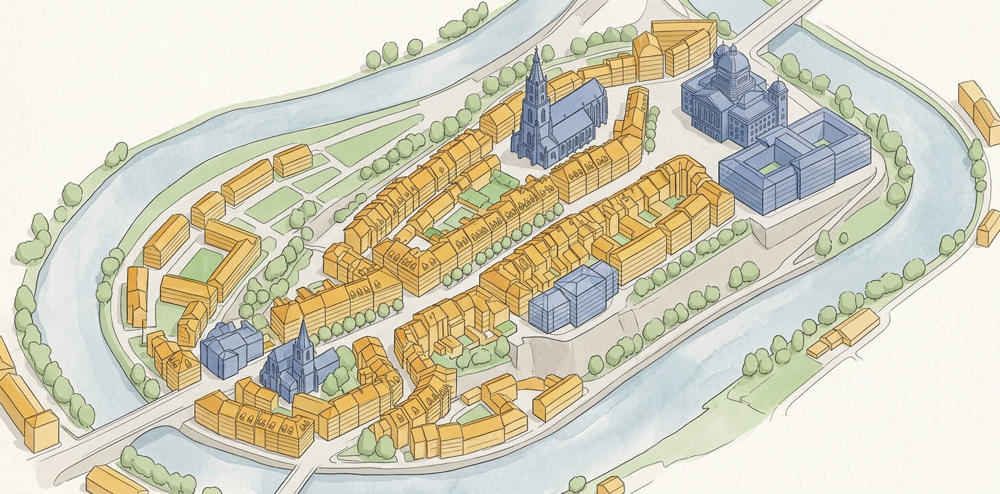
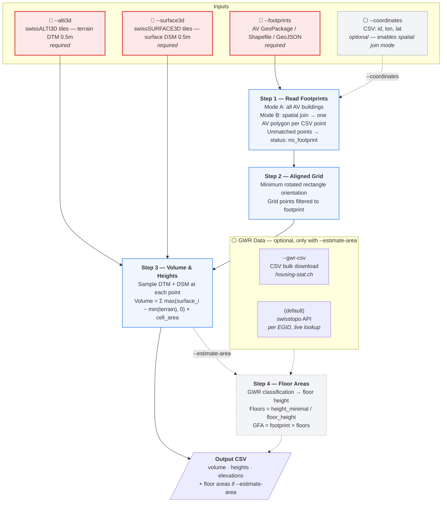

# Swiss Building Volume & Area Estimator




Estimates building volumes and gross floor areas using publicly available Swiss elevation models and cadastral data.

The solution is available in three variants:

- **[Web App](https://bbl-dres.github.io/area-estimator/)** — Zero-install browser app. Upload a CSV with building EGIDs, get volumes and floor areas on a map with export to CSV/Excel/GeoJSON.
- **[Python CLI](python/)** — Open-source, requires Python >= 3.10 and free dependencies. Processes locally with exact LV95 areas and local elevation tiles.
- **[FME](fme/)** — Requires a licensed copy of [FME Form](https://fme.safe.com/fme-form/).

<p align="center">
  
  
</p>
<p align="center">
  
</p>

---

## Web App

The browser-based version runs entirely client-side — no backend, no installation. Upload a CSV with `id` and `egid` columns and the app will:

1. Fetch building footprints from [geodienste.ch](https://geodienste.ch) WFS (`ms:LCSF`, filtered by `GWR_EGID`)
2. Load elevation data (DTM + DSM) from [swisstopo COG tiles](https://data.geo.admin.ch) on-the-fly
3. Compute volume and heights using an orientation-aligned 2×2m grid
4. Look up building classification from [GWR](https://www.housing-stat.ch) via swisstopo API
5. Estimate floor areas from building type and volume
6. Display results on an interactive map with table and summary panel

### Features

- **Interactive Map** — MapLibre GL JS with 3D building extrusions, orientation-aligned grid cell visualization, 4 basemaps, scale bar
- **Layer Panel** — Toggle Gebäudegrundflächen, Gebäudevolumen, Rasterzellen, Beschriftungen, and AV cadastral overlay
- **Summary Panel** — Collapsible sections for building status, volume/height aggregates, and floor area estimates
- **Table Widget** — Sortable columns, search filter, pagination, resizable panel, row click → map highlight
- **Export** — CSV, Excel (XLSX), and GeoJSON with timestamped filenames
- **Privacy** — All data stays in the browser. Only EGID and coordinates are sent to public APIs

### Limitations vs Python Version

| | Web App | Python CLI |
|---|---|---|
| **Data coverage** | 20 of 26 cantons via public WFS (JU, LU, NE, NW, OW, VD blocked) | All cantons via local GeoPackage |
| **Elevation data** | On-the-fly COG tile loading from swisstopo CDN | Local GeoTIFF tiles (faster, offline) |
| **Grid resolution** | 2×2m (configurable) | 1×1m (configurable) |
| **Area calculation** | Spherical (Turf.js), ~0.1–0.5% error for spatial matching | Exact planar (LV95/EPSG:2056) |
| **Throughput** | ~5 buildings in parallel, limited by API rate | Bulk processing with local data |
| **EGID lookup** | Direct WFS filter by `GWR_EGID` | Local GeoPackage spatial join |
| **Offline** | Requires internet | Fully offline with local data |

> **Data coverage note:** The Web App uses the geodienste.ch WFS, which requires cantonal approval in 6 cantons (JU, LU, NE, NW, OW, VD). Buildings in these cantons will return "Kein Grundriss". Coverage is also incomplete in TI, VS, and NE.

### Quick Start

Open `index.html` in a browser (requires a local server for ES modules):

```bash
cd area-estimator
python -m http.server 8080
# Open http://localhost:8080
```

Or deploy to any static hosting (GitHub Pages, Cloudflare Pages, etc.).

### File Structure

```
index.html                   Entry point (GitHub Pages compatible)
css/
  tokens.css                 Design tokens (colors, spacing, typography)
  styles.css                 Component styles + responsive breakpoints
js/
  main.js                    State machine (upload → processing → results)
  upload.js                  CSV/XLSX parsing with auto-delimiter detection
  processor.js               EGID/coord lookup + WFS query + volume pipeline (5× parallel)
  elevation.js               COG tile loading, oriented grid, volume computation
  map.js                     MapLibre map, 3D extrusions, grid cell visualization
  table.js                   Sortable table with pagination and search
  config.js                  API endpoints, floor height lookup, map styles
  export.js                  CSV/XLSX/GeoJSON export
data/
  example.csv                Demo data (10 buildings with verified EGIDs)
```

### APIs Used

| API | Purpose | Auth |
|-----|---------|------|
| `geodienste.ch/db/av_0/{lang}` WFS | Building footprints by EGID or BBOX (`ms:LCSF`) | None (CORS) |
| `api3.geo.admin.ch/MapServer/find` | GWR building attributes by EGID | None (CORS) |
| `data.geo.admin.ch` | swissALTI3D + swissSURFACE3D COG tiles | None (CORS) |

---

## Model Overview



> **Note:** The flowchart above describes the Python CLI pipeline. The Web App follows the same 4 steps but sources data from public APIs instead of local files.

---

## Python CLI

### Command-Line Reference

| Argument | Required | Description |
|----------|:--------:|-------------|
| **Input** | | |
| `--footprints FILE` | yes | Geodata file with building polygons (GeoPackage, Shapefile, or GeoJSON from AV). Alone: processes all buildings in the file. |
| `--coordinates FILE` | no | CSV with `id`, `lon`, `lat` columns (WGS84); optionally `egid` (reference only). When provided, performs a strict spatial join — only AV buildings containing a CSV point are processed. Points with no matching polygon are reported as `no_footprint` and skipped. No fallbacks. |
| **Elevation data** | | |
| `--alti3d DIR` | yes | Directory with swissALTI3D GeoTIFF tiles |
| `--surface3d DIR` | yes | Directory with swissSURFACE3D GeoTIFF tiles |
| `--auto-fetch` | | Automatically download missing tiles from swisstopo |
| **Output** | | |
| `-o, --output FILE` | | Output CSV file path (default: `data/output/result_<timestamp>.csv`) |
| **Filters** | | |
| `-l, --limit N` | | Process only the first N buildings |
| `-b, --bbox MIN_LON MIN_LAT MAX_LON MAX_LAT` | | Bounding box filter in WGS84 (only in all-buildings mode, i.e. without `--coordinates`) |
| **Area estimation** (off by default) | | |
| `--estimate-area` | | Enable Step 4: floor area estimation |
| `--gwr-csv FILE` | | GWR CSV from [housing-stat.ch](https://www.housing-stat.ch/de/data/supply/public.html); if omitted, uses swisstopo API |

### Setup

```bash
pip install -r python/requirements.txt
```

### Examples

```bash
# Portfolio list against AV footprints (spatial join)
python python/main.py \
    --footprints "D:\AV_lv95\av_2056.gpkg" \
    --coordinates my_buildings.csv \
    --alti3d "D:\SwissAlti3D" \
    --surface3d "D:\swissSURFACE3D Raster" \
    --auto-fetch \
    -o portfolio_volumes.csv

# All buildings in Switzerland
python python/main.py \
    --footprints data/av/ch_av_2056.gpkg \
    --alti3d /data/swisstopo/swissalti3d \
    --surface3d /data/swisstopo/swisssurface3d \
    --estimate-area --gwr-csv data/gwr/buildings.csv \
    -o results/ch_all_buildings.csv

# Quick test with auto-fetch (no local data needed)
python python/main.py \
    --footprints data/av/ch_av_2056.gpkg \
    --coordinates my_buildings.csv \
    --alti3d data/swissalti3d \
    --surface3d data/swisssurface3d \
    --auto-fetch \
    --limit 10
```

---

## Outputs

All results are written to a single CSV file (`result_<timestamp>.csv`).

### Step 1 — Footprints

Two modes, automatically selected based on which flags are provided:

- **AV only** (`--footprints`): Loads all building polygons from the geodata file and filters to buildings (`Art = Gebaeude`). Converts to LV95 if needed. The `egid` column is renamed to `av_egid`; each feature gets a `fid`.
- **AV + CSV** (`--footprints` + `--coordinates`): Strict spatial join — each CSV point must fall within an AV building polygon. No fallbacks. Rows with no match get `status_step1 = no_footprint` and are skipped.

### Step 2 — Aligned Grid

Fills each building footprint with a grid of sample points. The grid is rotated to align with the building's longest edge (using the minimum area bounding rectangle), so it fits tightly even for angled buildings. Grid resolution is 1×1m (Python) or 2×2m (Web App).

<p align="center">
  
</p>

### Step 3 — Volume & Heights

At each grid point, the tool reads two elevations: the ground level (DTM) and the surface level including buildings/trees (DSM). The above-ground height at each point is measured from the lowest terrain elevation under the building (`elevation_base_min`) as a flat horizontal datum — `max(surface_i − min(terrain), 0)`. Volume is the sum of all those heights, each multiplied by the cell area.

| Column | Description |
|--------|-------------|
| `area_footprint_m2` | Footprint area from AV polygon geometry (m²) |
| `volume_m3` | Total above-ground volume: `Σ max(surface_i − min(terrain), 0) × cell_area` |
| `elevation_base_min` | Lowest ground elevation — volume base datum (m a.s.l.) |
| `elevation_base_mean` | Mean ground elevation (m a.s.l.) |
| `elevation_base_max` | Highest ground elevation (m a.s.l.) |
| `elevation_roof_min` | Lowest surface elevation — typically the eave (m a.s.l.) |
| `elevation_roof_mean` | Mean surface elevation (m a.s.l.) |
| `elevation_roof_max` | Highest surface elevation — typically the ridge (m a.s.l.) |
| `height_mean` | Average above-ground height from `elevation_base_min` (m) |
| `height_max` | Tallest above-ground point (m) |
| `height_minimal` | `volume ÷ footprint area` — equivalent uniform box height (m) |
| `grid_points` | Number of grid points with valid DTM + DSM data |

### Step 4 — Floor Areas _(optional)_

Estimates gross floor area by dividing building height by a typical floor height for that building type. The building type comes from the GWR (Federal Register of Buildings). The tool looks up the floor height in this order: first by the specific building class (GKLAS, e.g. "Office building" → 3.80 m), then by the broader category (GKAT, e.g. "Non-residential" → 4.15 m), and falls back to a default of 3.00 m. Based on the [Canton Zurich methodology](https://are.zh.ch/) (Seiler & Seiler, 2020).

| Column | Description |
|--------|-------------|
| `gkat` | GWR building category code (e.g. 1020 = Residential) |
| `gklas` | GWR building class code (e.g. 1110 = Single-family house) |
| `gbauj` | Construction year |
| `gastw` | Number of stories (from register) |
| `floor_height_used` | Floor height used for estimation (m) |
| `floors_estimated` | Estimated floors: `height_minimal ÷ floor_height`, capped at GWR `gastw` if available |
| `area_floor_total_m2` | Gross floor area: `footprint × estimated floors` (m²) |
| `area_accuracy` | `high` (±10–15%) / `medium` (±15–25%) / `low` (±25–40%) |
| `building_type` | Human-readable building type |

---

## Limitations

| Limitation | Detail |
|------------|--------|
| No underground estimation | LIDAR only sees above ground — basements and underground floors are not included |
| Trees over buildings | The surface model doesn't distinguish roofs from foliage — tall trees over small buildings inflate the measured height and volume |
| Surface model merging | swissSURFACE3D combines ground, vegetation, and buildings into one surface; this can cause overestimation near vegetation |
| Small buildings | Footprints smaller than the grid cell size produce no grid points and can't be measured |
| Mixed-use buildings | A single floor height is applied per building; actual floor heights may vary (e.g. retail ground floor + residential upper floors) |
| Industrial / special buildings | Floor height ranges are wide (4–7 m), so floor count estimates are less reliable |
| Data timing | The elevation model may have been captured before or after the building was constructed or modified |
| Sloped terrain | Volume is measured from `elevation_base_min` (lowest terrain point) as a flat datum. On steeply sloped sites, this includes terrain undulation. |
| Web App coverage | 6 cantons (JU, LU, NE, NW, OW, VD) block the geodienste.ch WFS — use the Python CLI with a local GeoPackage for full coverage |

---

## Project Structure

```
area-estimator/
├── index.html                        ← Web App entry point (GitHub Pages)
├── css/                              ← Stylesheets
│   ├── tokens.css                       Design tokens
│   └── styles.css                       Component styles
├── js/                               ← Web App modules
│   ├── main.js                          State machine + UI
│   ├── upload.js                        CSV/XLSX parsing
│   ├── processor.js                     EGID lookup + WFS + volume pipeline
│   ├── elevation.js                     COG tiles, oriented grid, volume
│   ├── map.js                           MapLibre map + 3D visualization
│   ├── table.js                         Results table
│   ├── config.js                        Endpoints, floor heights, constants
│   └── export.js                        CSV/XLSX/GeoJSON export
├── python/                           ← Python CLI (Steps 1–4)
│   ├── main.py                          CLI entry point
│   ├── footprints.py                    Step 1: load footprints / coordinates
│   ├── grid.py                          Step 2: aligned grid
│   ├── volume.py                        Step 3: elevation sampling & volume
│   ├── tile_fetcher.py                  On-demand tile download from swisstopo
│   ├── gwr.py                           GWR lookup (CSV + API)
│   ├── area.py                          Step 4: floor area estimation
│   └── requirements.txt
├── fme/                              ← FME workbench (requires license)
├── tools/
│   ├── roof-estimator/               ← Roof shape analysis from 3D meshes
│   └── green-roof-eval/              ← Green roof detection (FME-based)
├── legacy/                           ← Original implementations (reference)
├── data/                             ← .gitignored (except example.csv)
│   ├── example.csv                      Demo data for Web App
│   ├── output/                          Pipeline results
│   ├── gwr/                             GWR CSV download
│   ├── swissalti3d/                     Terrain tiles
│   └── swisssurface3d/                  Surface tiles
└── images/
```

---

## Floor Height Lookup

| Code | Building Type | Schema | GF (m) | UF (m) |
|------|---------------|--------|--------|--------|
| 1010 | Provisional shelter | GKAT | 2.70–3.30 | 2.70–3.30 |
| 1030 | Residential with secondary use | GKAT | 2.70–3.30 | 2.70–3.30 |
| 1040 | Partially residential | GKAT | 3.30–3.70 | 2.70–3.70 |
| 1060 | Non-residential | GKAT | 3.30–5.00 | 3.00–5.00 |
| 1080 | Special-purpose | GKAT | 3.00–4.00 | 3.00–4.00 |
| 1110 | Single-family house | GKLAS | 2.70–3.30 | 2.70–3.30 |
| 1121 | Two-family house | GKLAS | 2.70–3.30 | 2.70–3.30 |
| 1122 | Multi-family house | GKLAS | 2.70–3.30 | 2.70–3.30 |
| 1130 | Community residential | GKLAS | 2.70–3.30 | 2.70–3.30 |
| 1211 | Hotel | GKLAS | 3.30–3.70 | 3.00–3.50 |
| 1212 | Short-term accommodation | GKLAS | 3.00–3.50 | 3.00–3.50 |
| 1220 | Office building | GKLAS | 3.40–4.20 | 3.40–4.20 |
| 1230 | Wholesale and retail | GKLAS | 3.40–5.00 | 3.40–5.00 |
| 1231 | Restaurants and bars | GKLAS | 3.30–4.00 | 3.30–4.00 |
| 1241 | Stations and terminals | GKLAS | 4.00–6.00 | 4.00–6.00 |
| 1242 | Parking garages | GKLAS | 2.80–3.20 | 2.80–3.20 |
| 1251 | Industrial building | GKLAS | 4.00–7.00 | 4.00–7.00 |
| 1252 | Tanks, silos, warehouses | GKLAS | 3.50–6.00 | 3.50–6.00 |
| 1261 | Culture and leisure | GKLAS | 3.50–5.00 | 3.50–5.00 |
| 1262 | Museums and libraries | GKLAS | 3.50–5.00 | 3.50–5.00 |
| 1263 | Schools and universities | GKLAS | 3.30–4.00 | 3.30–4.00 |
| 1264 | Hospitals and clinics | GKLAS | 3.30–4.00 | 3.30–4.00 |
| 1265 | Sports halls | GKLAS | 3.00–6.00 | 3.00–6.00 |
| 1271 | Agricultural buildings | GKLAS | 3.50–5.00 | 3.50–5.00 |
| 1272 | Churches and religious buildings | GKLAS | 3.00–6.00 | 3.00–6.00 |
| 1273 | Monuments and protected buildings | GKLAS | 3.00–4.00 | 3.00–4.00 |
| 1274 | Other structures | GKLAS | 3.00–4.00 | 3.00–4.00 |
| — | Default (unknown) | — | 2.70–3.30 | 2.70–3.30 |

---

## References

| Resource | Link |
|----------|------|
| Amtliche Vermessung (AV) | [geodienste.ch/services/av](https://www.geodienste.ch/services/av) |
| swissALTI3D | [swisstopo.admin.ch](https://www.swisstopo.admin.ch/de/hoehenmodell-swissalti3d) |
| swissSURFACE3D Raster | [swisstopo.admin.ch](https://www.swisstopo.admin.ch/de/hoehenmodell-swisssurface3d-raster) |
| swisstopo Search API | [docs.geo.admin.ch](https://docs.geo.admin.ch/access-data/search.html) |
| swisstopo Find API | [docs.geo.admin.ch](https://docs.geo.admin.ch/access-data/find-features.html) |
| GWR | [housing-stat.ch](https://www.housing-stat.ch/de/index.html) |
| GWR Public Data | [housing-stat.ch/data](https://www.housing-stat.ch/de/data/supply/public.html) |
| GWR Catalog v4.3 | [housing-stat.ch/catalog](https://www.housing-stat.ch/catalog/en/4.3/final) |
| Canton Zurich Methodology | Seiler & Seiler GmbH, Dec 2020 — [are.zh.ch](https://are.zh.ch/) |
| DM.01-AV-CH Data Model | [cadastre-manual.admin.ch](https://www.cadastre-manual.admin.ch/de/datenmodell-der-amtlichen-vermessung-dm01-av-ch) |

---

## Future Development

| Feature | Description |
|---------|-------------|
| Watertight 3D mesh | Generate closed building geometry from elevation data |
| Roof geometry estimation | Classify roof shapes (flat, gable, hip) and estimate roof surface areas |
| Outer wall quantities | Estimate exterior wall areas from footprint perimeter and height metrics |
| Material classification | Building material detection from imagery or other data sources |
| International buildings | Extend beyond Switzerland using alternative elevation and cadastral data |

---

## Tech Stack & Credits

### Web App

| Library | Version | Purpose |
|---------|---------|---------|
| [MapLibre GL JS](https://maplibre.org/) | 4.7 | Interactive map with 3D fill-extrusion rendering |
| [GeoTIFF.js](https://geotiffjs.github.io/) | 2.1 | Cloud Optimized GeoTIFF (COG) reading in-browser |
| [Turf.js](https://turfjs.org/) | 7 | Spatial operations (point-in-polygon, distance, centroid) |
| [proj4js](http://proj4js.org/) | 2.12 | Coordinate transforms (WGS84 ↔ LV95/EPSG:2056) |
| [SheetJS (XLSX)](https://sheetjs.com/) | 0.18 | Excel import/export (lazy-loaded) |
| [Source Sans 3](https://fonts.google.com/specimen/Source+Sans+3) | — | Typography |
| [Material Symbols](https://fonts.google.com/icons) | — | UI icons |

### Python CLI

| Library | Purpose |
|---------|---------|
| [GeoPandas](https://geopandas.org/) | Vector geodata processing |
| [Rasterio](https://rasterio.readthedocs.io/) | GeoTIFF reading with windowed access |
| [Shapely](https://shapely.readthedocs.io/) | Geometry operations, minimum rotated rectangle |
| [NumPy](https://numpy.org/) | Vectorized grid creation and elevation sampling |
| [pyproj](https://pyproj4.github.io/pyproj/) | CRS transforms |

### Data Sources

| Provider | Dataset | Usage |
|----------|---------|-------|
| [swisstopo](https://www.swisstopo.admin.ch/) | swissALTI3D, swissSURFACE3D | Terrain (DTM) and surface (DSM) elevation models at 0.5m resolution |
| [geodienste.ch](https://www.geodienste.ch/) | Amtliche Vermessung (AV) WFS | Building footprints from official cadastral survey |
| [BFS](https://www.bfs.admin.ch/) | GWR (Gebäude- und Wohnungsregister) | Building classification, construction year, floor count |
| [CARTO](https://carto.com/) | Positron, Dark Matter | Basemap tiles |

### Methodology

Floor area estimation is based on the methodology developed by Seiler & Seiler GmbH (Dec 2020) for the [Canton of Zurich ARE](https://are.zh.ch/).

---

## License

MIT License — see [LICENSE](LICENSE).
