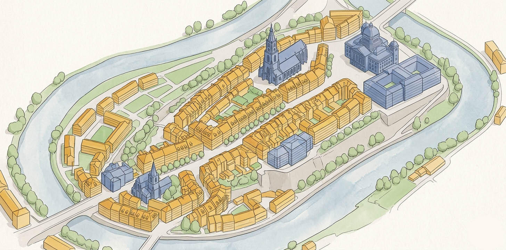
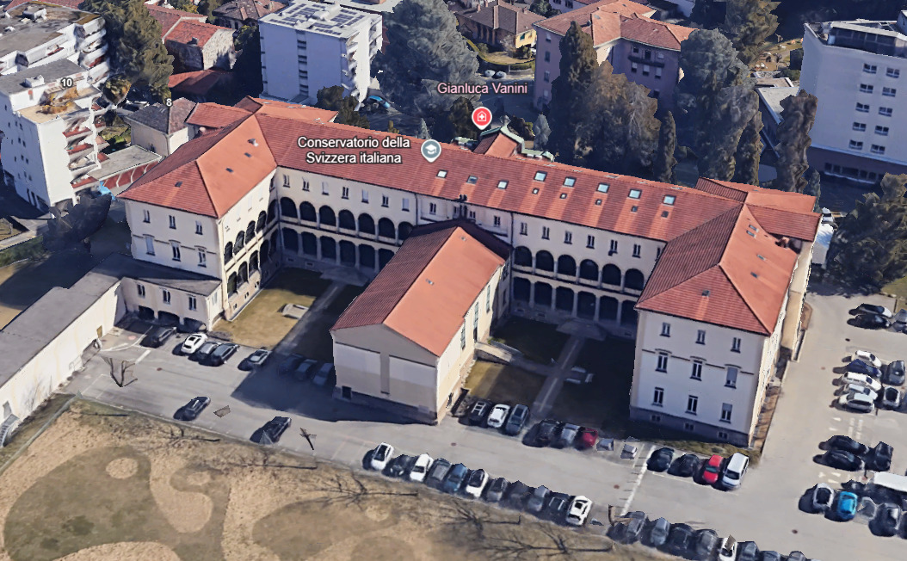
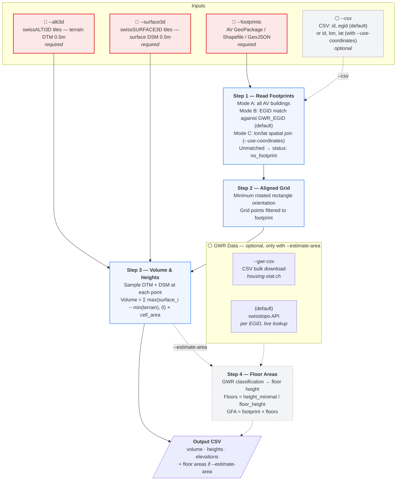

# Swiss Building Volume & Area Estimator




Estimates building volumes and gross floor areas using publicly available Swiss elevation models and cadastral data.

The solution is available in three variants:

- **[Web App](https://bbl-dres.github.io/area-estimator/)** — Zero-install browser app in [`webapp/`](webapp/). Upload a CSV with building EGIDs, get volumes and floor areas on a map with export to CSV/Excel/GeoJSON.
- **[Python CLI](python/)** — Open-source, requires Python 3.10+ and free dependencies. Processes locally with exact LV95 areas and local elevation tiles. **See [python/README.md](python/README.md) for full CLI reference, output schema, and developer details.**
- **[FME](fme/)** — Workbench implementing Steps 1–3, requires a licensed copy of [FME Form](https://fme.safe.com/fme-form/). **See [fme/README.md](fme/README.md) for the transformer pipeline.**

<p align="center">
  
  
</p>
<p align="center">
  
</p>

---

## Web App

The browser-based version runs entirely client-side — no backend, no installation. Upload a CSV with `id` and `egid` columns and the app will:

1. Fetch building footprints from [geodienste.ch](https://geodienste.ch) WFS (`ms:LCSF`, filtered by `GWR_EGID`)
2. Load elevation data (DTM + DSM) from [swisstopo COG tiles](https://data.geo.admin.ch) on-the-fly
3. Compute volume and heights using an orientation-aligned 2×2m grid
4. Look up building classification from [GWR](https://www.housing-stat.ch) via swisstopo API
5. Estimate floor areas from building type and volume
6. Display results on an interactive map with table and summary panel

### Features

- **Interactive Map** — MapLibre GL JS with 3D building extrusions, orientation-aligned grid cell visualization, 4 basemaps, scale bar
- **Layer Panel** — Toggle Gebäudegrundflächen, Gebäudevolumen, Rasterzellen, Beschriftungen, and AV cadastral overlay
- **Summary Panel** — Collapsible sections for building status, volume/height aggregates, and floor area estimates
- **Table Widget** — Sortable columns, search filter, pagination, resizable panel, row click → map highlight
- **Export** — CSV, Excel (XLSX), and GeoJSON with timestamped filenames
- **Privacy** — All data stays in the browser. Only EGID and coordinates are sent to public APIs

### Limitations vs Python Version

| | Web App | Python CLI |
|---|---|---|
| **Data coverage** | 20 of 26 cantons via public WFS (JU, LU, NE, NW, OW, VD blocked) | All cantons via local GeoPackage |
| **Elevation data** | On-the-fly COG tile loading from swisstopo CDN | Local GeoTIFF tiles (faster, offline) |
| **Grid resolution** | 2×2m (configurable) | 1×1m (configurable) |
| **Area calculation** | Spherical (Turf.js), ~0.1–0.5% error for spatial matching | Exact planar (LV95/EPSG:2056) |
| **Throughput** | ~5 buildings in parallel, limited by API rate | Bulk processing with local data |
| **EGID lookup** | Direct WFS filter by `GWR_EGID` | Local GeoPackage spatial join |
| **Offline** | Requires internet | Fully offline with local data |

> **Data coverage note:** The Web App uses the geodienste.ch WFS, which requires cantonal approval in 6 cantons (JU, LU, NE, NW, OW, VD). Buildings in these cantons will return "Kein Grundriss". Coverage is also incomplete in TI, VS, and NE.

### Quick Start

Open `webapp/index.html` in a browser (requires a local server for ES modules):

```bash
cd area-estimator
python -m http.server 8080
# Open http://localhost:8080/webapp/
```

Or deploy to any static hosting (GitHub Pages, Cloudflare Pages, etc.). For GitHub Pages, point the source at the `webapp/` subfolder of your branch — see [GitHub's docs on publishing from a folder](https://docs.github.com/en/pages/getting-started-with-github-pages/configuring-a-publishing-source-for-your-github-pages-site#publishing-from-a-branch).

> The web app reads `../data/example.csv` for the demo dataset, so the `data/` directory must remain at the project root (one level above `webapp/`) for the demo button to work.

### APIs Used

| API | Purpose | Auth |
|-----|---------|------|
| `geodienste.ch/db/av_0/{lang}` WFS | Building footprints by EGID or BBOX (`ms:LCSF`) | None (CORS) |
| `api3.geo.admin.ch/MapServer/find` | GWR building attributes by EGID | None (CORS) |
| `data.geo.admin.ch` | swissALTI3D + swissSURFACE3D COG tiles | None (CORS) |

---

## Model Overview



> **Note:** The flowchart describes the Python CLI pipeline. The Web App follows the same 4 steps but sources data from public APIs instead of local files. The FME workbench implements Steps 1–3 only (no floor-area estimation).

---

## Quick Start — Python CLI

```bash
pip install -r python/requirements.txt

python python/main.py \
    --footprints "D:\AV_lv95\av_2056.gpkg" \
    --csv data/example.csv \
    --alti3d "D:\SwissAlti3D" \
    --surface3d "D:\swissSURFACE3D Raster" \
    --estimate-area \
    -o portfolio_volumes.csv
```

For the full command-line reference, output schema, accuracy bucketing, warning catalog, and Floor Height Lookup table, see **[python/README.md](python/README.md)**.

---

## AV vs GWR

The pipeline uses two distinct Swiss data registers, linked by the `GWR_EGID` attribute:

- **AV (Amtliche Vermessung)** — the cadastral survey, providing building **geometry** (parcel and footprint polygons). Maintained by cantonal survey offices, available via [geodienste.ch](https://www.geodienste.ch/).
- **GWR (Gebäude- und Wohnungsregister)** — the federal building register, providing building **master data**: addresses, classification, construction year, dwelling counts. Maintained by the Federal Statistical Office, available via the [BFS](https://www.bfs.admin.ch/) and [swisstopo APIs](https://api3.geo.admin.ch/).

The pipeline uses AV polygons for the footprint geometry (needed by Steps 1–3 to compute volume) and GWR classification (needed by Step 4 to convert volume to floor area). EGID is the natural key. A few percent of AV building polygons have no EGID assigned, which is why coordinate-based matching is kept as an option (`--use-coordinates`).

---

## Limitations

| Limitation | Detail |
|------------|--------|
| No underground estimation | LIDAR only sees above ground — basements and underground floors are not included |
| Trees over buildings | The surface model doesn't distinguish roofs from foliage — tall trees over small buildings inflate the measured height and volume |
| Surface model merging | swissSURFACE3D combines ground, vegetation, and buildings into one surface; this can cause overestimation near vegetation |
| Small buildings | Footprints smaller than the grid cell size produce no grid points and can't be measured |
| Mixed-use buildings | A single floor height is applied per building; actual floor heights may vary (e.g. retail ground floor + residential upper floors) |
| Industrial / special buildings | Floor height ranges are wide (4–7 m), so floor count estimates are less reliable |
| Data timing | The elevation model may have been captured before or after the building was constructed or modified |
| Sloped terrain | Volume is measured from `elevation_base_min` (lowest terrain point) as a flat datum. On steeply sloped sites, this includes terrain undulation. |
| Polygon validity vs. display | A handful of AV polygons have edge-case geometry (self-touching rings, near-degenerate vertices) that some GIS renderers (e.g. ArcGIS) refuse to draw. **The planar area is still computed correctly** — Shapely/GEOS is more permissive about edge-case validity than display engines, and `polygon.area` returns the right value for these features. If you need to display the same polygons in a map, you may need to dissolve/clean them in your GIS tool first; that does not affect this pipeline's numbers. |
| Web App coverage | 6 cantons (JU, LU, NE, NW, OW, VD) block the geodienste.ch WFS — use the Python CLI with a local GeoPackage for full coverage |

---

## Project Structure

```
area-estimator/
├── README.md                      ← You are here (overview, web app, limitations)
├── webapp/                        ← Browser app — served by GitHub Pages
│   ├── index.html                    Entry point
│   ├── css/                          Stylesheets (tokens.css, styles.css)
│   └── js/                           Modules (main.js, processor.js, …)
├── python/                        ← Python CLI — see python/README.md
│   ├── README.md                     CLI reference, output schema, tests, type hints
│   ├── main.py                       CLI entry point + aggregate_by_input_id
│   ├── footprints.py                 Step 1: load footprints
│   ├── volume.py                     Steps 2 + 3: grid + volume + heights, BuildingResult
│   ├── area.py                       Step 4: GWR enrichment + floor area
│   ├── tile_fetcher.py               On-demand tile download
│   ├── tests/                        pytest suite — see python/tests/README.md
│   ├── experimental/                 Standalone exploration tools (not in pipeline)
│   │   ├── floor-level-estimator.py     Earlier per-floor estimator with gbaup factor
│   │   └── roof-estimator/              Roof shape analysis from 3D meshes
│   └── requirements.txt
├── fme/                           ← FME workbenches — see fme/README.md
│   ├── README.md                     Volume Estimator pipeline summary
│   ├── Volume Estimator FME.fmw      The main workbench (Steps 1–3)
│   └── experimental/                 Older / unmaintained workbenches
│       ├── green-roof-eval/             Green roof detection from swissIMAGE RS
│       └── roof-estimator-deprecated/   Earlier FME version of the roof estimator
├── docs/
│   ├── Height Assumptions.md         Validation study for the floor-height table
│   └── 20260112_GruenflaechenInventar.pdf   Reference document for the green-roof tool
├── legacy/                        ← Original implementations (historical reference, untouched)
├── data/                          ← .gitignored except example.csv
│   └── example.csv                   Demo data for both web app and Python CLI
└── assets/                        ← Images used by the READMEs and the web app
```

---

## Future Development

| Feature | Description |
|---------|-------------|
| Watertight 3D mesh | Generate closed building geometry from elevation data |
| Roof geometry estimation | Classify roof shapes (flat, gable, hip) and estimate roof surface areas |
| Outer wall quantities | Estimate exterior wall areas from footprint perimeter and height metrics |
| Material classification | Building material detection from imagery or other data sources |
| International buildings | Extend beyond Switzerland using alternative elevation and cadastral data |
| Eaves-height floor count | Use `elevation_roof_min − elevation_base_min` (≈ eaves height for pitched roofs) as the input to floor counting instead of `height_minimal`. Equivalent for flat roofs, more accurate for SFH/MFH with attics: `height_minimal` sits between eaves and ridge and slightly over-counts floors. Cheap to add as an extra `height_eaves_m` column in Step 3. |
| Voxel-slice GFA estimation | Replace `footprint × floors` with horizontal slab integration over the per-cell heightfield: for each slab `k`, count cells where building height ≥ slab ceiling, multiply by cell area, sum across slabs. Naturally handles setbacks, attics, towers, dormers, and stepped buildings — cases where the current method silently overcounts because it assumes every floor is the full footprint. Open questions to investigate: (1) cell-qualification rule (strict vs. centerline vs. tunable threshold for partial floors), (2) sensitivity to the assumed floor height, (3) handling of trees-over-buildings noise, (4) per-floor slab areas in the output as a JSON column. Should be opt-in via `--gfa-method slice` and validated against buildings with known drawings before becoming the default. |

---

## References

| Resource | Link |
|----------|------|
| Amtliche Vermessung (AV) | [geodienste.ch/services/av](https://www.geodienste.ch/services/av) |
| swissALTI3D | [swisstopo.admin.ch](https://www.swisstopo.admin.ch/de/hoehenmodell-swissalti3d) |
| swissSURFACE3D Raster | [swisstopo.admin.ch](https://www.swisstopo.admin.ch/de/hoehenmodell-swisssurface3d-raster) |
| swisstopo Search API | [docs.geo.admin.ch](https://docs.geo.admin.ch/access-data/search.html) |
| swisstopo Find API | [docs.geo.admin.ch](https://docs.geo.admin.ch/access-data/find-features.html) |
| GWR | [housing-stat.ch](https://www.housing-stat.ch/de/index.html) |
| GWR Public Data | [housing-stat.ch/data](https://www.housing-stat.ch/de/data/supply/public.html) |
| GWR Catalog v4.3 | [housing-stat.ch/catalog](https://www.housing-stat.ch/catalog/en/4.3/final) |
| Canton Zurich Methodology | Seiler & Seiler GmbH, Dec 2020 — [are.zh.ch](https://are.zh.ch/) |
| DM.01-AV-CH Data Model | [cadastre-manual.admin.ch](https://www.cadastre-manual.admin.ch/de/datenmodell-der-amtlichen-vermessung-dm01-av-ch) |
| Height assumptions validation study | [docs/Height Assumptions.md](docs/Height%20Assumptions.md) |

---

## Tech Stack & Credits

### Web App

| Library | Version | Purpose |
|---------|---------|---------|
| [MapLibre GL JS](https://maplibre.org/) | 4.7 | Interactive map with 3D fill-extrusion rendering |
| [GeoTIFF.js](https://geotiffjs.github.io/) | 2.1 | Cloud Optimized GeoTIFF (COG) reading in-browser |
| [Turf.js](https://turfjs.org/) | 7 | Spatial operations (point-in-polygon, distance, centroid) |
| [proj4js](http://proj4js.org/) | 2.12 | Coordinate transforms (WGS84 ↔ LV95/EPSG:2056) |
| [SheetJS (XLSX)](https://sheetjs.com/) | 0.18 | Excel import/export (lazy-loaded) |
| [Source Sans 3](https://fonts.google.com/specimen/Source+Sans+3) | — | Typography |
| [Material Symbols](https://fonts.google.com/icons) | — | UI icons |

### Python CLI

| Library | Purpose |
|---------|---------|
| [GeoPandas](https://geopandas.org/) | Vector geodata processing |
| [Rasterio](https://rasterio.readthedocs.io/) | GeoTIFF reading with windowed access |
| [Shapely](https://shapely.readthedocs.io/) | Geometry operations, minimum rotated rectangle |
| [NumPy](https://numpy.org/) | Vectorized grid creation and elevation sampling |
| [pyproj](https://pyproj4.github.io/pyproj/) | CRS transforms |

### Data Sources

| Provider | Dataset | Usage |
|----------|---------|-------|
| [swisstopo](https://www.swisstopo.admin.ch/) | swissALTI3D, swissSURFACE3D | Terrain (DTM) and surface (DSM) elevation models at 0.5m resolution |
| [geodienste.ch](https://www.geodienste.ch/) | Amtliche Vermessung (AV) WFS | Building footprints from official cadastral survey |
| [BFS](https://www.bfs.admin.ch/) | GWR (Gebäude- und Wohnungsregister) | Building classification, construction year, floor count |
| [CARTO](https://carto.com/) | Positron, Dark Matter | Basemap tiles |

### Methodology

Floor area estimation is based on the methodology developed by Seiler & Seiler GmbH (Dec 2020) for the [Canton of Zurich ARE](https://are.zh.ch/). The per-GWR-code accuracy buckets are derived from an independent validation against Swiss regulatory anchors (ArGV4, SIA 2024, cantonal building codes) — see [docs/Height Assumptions.md](docs/Height%20Assumptions.md).

---

## License

MIT License — see [LICENSE](LICENSE).
