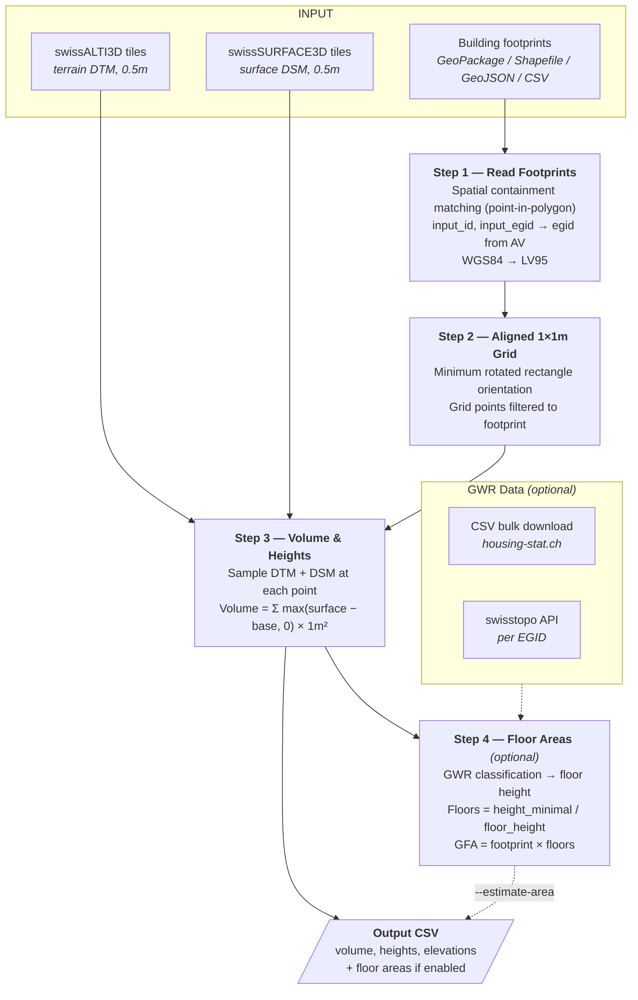
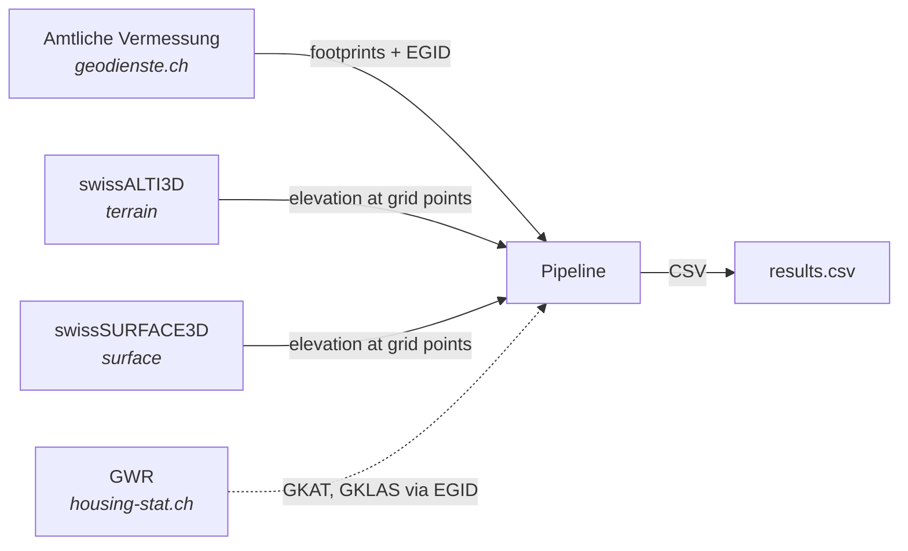
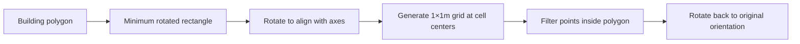
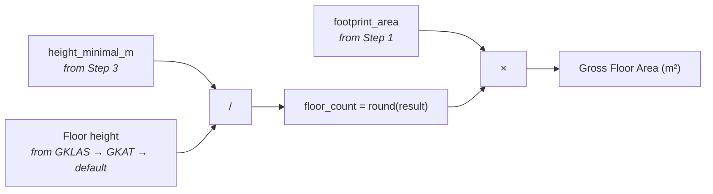

# Swiss Building Volume & Area Estimator


Estimates building volumes and gross floor areas using publicly available Swiss elevation models and cadastral data.

<p align="center">
  
  
</p>
<p align="center">
  
</p>

## Model Overview



### Data flow



---

## Quick Start

### Install

```bash
pip install -r python/requirements.txt
```

### Process buildings from Amtliche Vermessung

```bash
python python/main.py \
    --footprints data/bodenbedeckung.gpkg \
    --alti3d data/swissalti3d \
    --surface3d data/swisssurface3d \
    -o results.csv
```

### Process a list of coordinates

```bash
python python/main.py \
    --coordinates my_buildings.csv \
    --alti3d data/swissalti3d \
    --surface3d data/swisssurface3d \
    -o results.csv
```

Where `my_buildings.csv` contains:

```csv
lon,lat,egid
7.4474,46.9480,1234567
7.4512,46.9495,2345678
```

### Process a GeoJSON with AV footprint lookup

For GeoJSON files with building addresses (e.g. point features with EGID), the pipeline
looks up the actual building footprint from the Amtliche Vermessung via spatial query:

```bash
python python/main.py \
    --geojson data/buildings.geojson \
    --av D:/AV_lv95/av_2056.gpkg \
    --alti3d D:/SwissAlti3D \
    --surface3d "D:/swissSURFACE3D Raster" \
    --auto-fetch \
    -o data/output/results.csv
```

`--auto-fetch` downloads any missing elevation tiles from swisstopo on the fly.

### With filters

```bash
# Bounding box (WGS84)
python python/main.py --footprints data/bodenbedeckung.gpkg \
    --alti3d data/swissalti3d --surface3d data/swisssurface3d \
    --bbox 7.43 47.15 7.48 47.19 -o zurich_sample.csv

# First N buildings
python python/main.py --footprints data/bodenbedeckung.gpkg \
    --alti3d data/swissalti3d --surface3d data/swisssurface3d \
    --limit 100 -o first_100.csv
```

### With floor area estimation (Step 4)

```bash
# Bulk GWR CSV (recommended for large batches)
python python/main.py --footprints data/bodenbedeckung.gpkg \
    --alti3d data/swissalti3d --surface3d data/swisssurface3d \
    --estimate-area --gwr-csv data/gwr/gebaeude.csv \
    -o results_with_areas.csv

# swisstopo API fallback (for small batches)
python python/main.py --coordinates my_buildings.csv \
    --alti3d data/swissalti3d --surface3d data/swisssurface3d \
    --estimate-area -o results_with_areas.csv
```

---

## Command-Line Reference

| Argument | Required | Description |
|----------|:--------:|-------------|
| **Input** (one required) | | |
| `--footprints FILE` | * | Geodata file (`.gpkg`, `.shp`, `.geojson`) from Amtliche Vermessung |
| `--coordinates FILE` | * | CSV with `lon`, `lat` columns (WGS84), optionally `egid`, `fid` |
| `--geojson FILE` | * | GeoJSON with building addresses (Point + EGID) — requires `--av` |
| **Elevation data** | | |
| `--alti3d DIR` | yes | Directory with swissALTI3D GeoTIFF tiles |
| `--surface3d DIR` | yes | Directory with swissSURFACE3D GeoTIFF tiles |
| `--auto-fetch` | | Automatically download missing tiles from swisstopo |
| **AV lookup** (for `--geojson`) | | |
| `--av FILE` | with `--geojson` | AV GeoPackage (e.g. `av_2056.gpkg`) for footprint lookup |
| `--av-layer NAME` | | AV layer name (default: `lcsf`) |
| **Output** | | |
| `-o, --output FILE` | yes | Output CSV file path |
| **Filters** | | |
| `-l, --limit N` | | Process only the first N buildings |
| `-b, --bbox W S E N` | | Bounding box in WGS84 (only with `--footprints`) |
| **Area estimation** (off by default) | | |
| `--estimate-area` | | Enable Step 4: floor area estimation |
| `--gwr-csv FILE` | | GWR CSV from [housing-stat.ch](https://www.housing-stat.ch/de/data/supply/public.html); if omitted, uses swisstopo API |

---

## Inputs

| Dataset | Status | Used in | Description | Source |
|---------|:------:|:-------:|-------------|--------|
| **Building footprints** | MUST | Step 1 | Building polygons — `.gpkg`, `.shp`, `.geojson`, or CSV with coordinates | [geodienste.ch](https://www.geodienste.ch/services/av) |
| **Amtliche Vermessung** | MUST (with `--geojson`) | Step 1 | AV GeoPackage — spatial footprint lookup via point-in-polygon | [geodienste.ch](https://www.geodienste.ch/services/av) |
| **swissALTI3D** | MUST | Step 3 | Terrain elevation (DTM), 0.5m resolution, 1 km² GeoTIFF tiles | [swisstopo](https://www.swisstopo.admin.ch/de/hoehenmodell-swissalti3d) |
| **swissSURFACE3D Raster** | MUST | Step 3 | Surface elevation (DSM), 0.5m resolution, 1 km² GeoTIFF tiles | [swisstopo](https://www.swisstopo.admin.ch/de/hoehenmodell-swisssurface3d-raster) |
| **GWR classification** | OPTIONAL | Step 4 | Building category/class for floor height lookup, via EGID | [housing-stat.ch](https://www.housing-stat.ch/de/data/supply/public.html) |

### Building footprints (Step 1)

Three input modes:

| Input mode | Flag | Accepts | Matching |
|------------|------|---------|----------|
| Geodata file | `--footprints` | `.gpkg`, `.shp`, `.geojson` — auto-filters to `Art = Gebaeude` | Direct polygons from file |
| Coordinates | `--coordinates` | CSV with `lon`, `lat` (optionally `egid`, `fid`) — buffered to 10×10 m | No AV lookup |
| GeoJSON + AV | `--geojson` + `--av` | GeoJSON with Point geometries (WGS84) | **Spatial containment** — point must fall inside an AV building polygon |

For `--geojson` mode, matching is purely spatial: the WGS84 point is transformed to LV95 and tested against AV building polygons. If the point falls inside a polygon, the footprint and its `GWR_EGID` are used. If not, the feature gets status `no_building_at_point`. There is no fuzzy or nearest-neighbor matching.

### Elevation tiles (Step 3)

| Dataset | Type | Measures | Resolution | Format |
|---------|------|----------|:----------:|--------|
| **swissALTI3D** | DTM | Bare earth elevation | 0.5 m | Cloud-Optimized GeoTIFF |
| **swissSURFACE3D Raster** | DSM | Top of buildings, vegetation | 0.5 m | Cloud-Optimized GeoTIFF |

Tile naming: `swissalti3d_YYYY_XXXX-YYYY_0.5_2056_5728.tif` — tile ID = SW corner in LV95 ÷ 1000. With `--auto-fetch`, missing tiles are downloaded from swisstopo on demand.

### GWR classification (Step 4, optional)

| Property | Value |
|----------|-------|
| Source | [housing-stat.ch](https://www.housing-stat.ch/de/index.html) |
| Catalog | [GWR v4.3](https://www.housing-stat.ch/catalog/en/4.3/final) |
| Key fields | `GKAT` (category), `GKLAS` (class), `GBAUJ` (year), `GASTW` (stories) |
| Access | CSV bulk from [housing-stat.ch/data](https://www.housing-stat.ch/de/data/supply/public.html) or swisstopo API per EGID |

---

## Outputs

All results are written to a single CSV file (`result_<timestamp>.csv`).

### Step 1 — Identifiers & Metadata

Carried through from input and AV spatial matching.

| Column | Status | Source | Description |
|--------|:------:|--------|-------------|
| `input_id` | MUST | Input | User-provided identifier (e.g. `bbl_id` from GeoJSON) |
| `input_egid` | OPTIONAL | Input | EGID from input data (reference only, not used for matching) |
| `input_lon` | MUST | Input | Original WGS84 longitude |
| `input_lat` | MUST | Input | Original WGS84 latitude |
| `egid` | MUST | AV | Authoritative federal building ID (`GWR_EGID` from AV) |
| `fid` | MUST | AV | GeoPackage feature ID — direct link to AV polygon |
| `area_footprint_m2` | MUST | Geometry | Footprint area computed from polygon (m²) |
| `area_official_m2` | OPTIONAL | AV | Official area attribute from source data (m²) |

### Step 3 — Volume & Heights

Computed from DTM + DSM elevation sampling on the 1×1m grid.

| Column | Status | Source | Description |
|--------|:------:|--------|-------------|
| `volume_above_ground_m3` | MUST | DTM + DSM | Above-ground building volume (m³) |
| `elevation_base_m` | MUST | DTM | Lowest terrain elevation under footprint (m asl) — reference plane for all heights |
| `elevation_roof_base_m` | MUST | DSM | Lowest surface elevation in footprint — estimated eave (m asl) |
| `height_mean_m` | MUST | DTM + DSM | Mean building height above base (m) |
| `height_max_m` | MUST | DTM + DSM | Max building height above base — ridge (m) |
| `height_minimal_m` | MUST | Derived | volume / footprint area — equivalent uniform box height (m) |
| `grid_points_count` | MUST | — | Number of valid elevation sample points |
| `status` | MUST | — | `success` / `no_building_at_point` / `no_grid_points` / `no_height_data` / `error` |

### Step 4 — Floor Areas (optional, `--estimate-area`)

Added when Step 4 is enabled. Based on GWR building classification.

| Column | Status | Source | Description |
|--------|:------:|--------|-------------|
| `gkat` | OPTIONAL | GWR | Building category code (1010–1080) |
| `gklas` | OPTIONAL | GWR | Building class code (1110–1274) |
| `gbauj` | OPTIONAL | GWR | Construction year |
| `gastw` | OPTIONAL | GWR | Number of stories (GWR value) |
| `area_floor_total_m2` | MUST | Derived | Gross floor area (m²) |
| `floors_estimated` | MUST | Derived | Estimated floor count |
| `floor_height_used_m` | MUST | Derived | Floor height applied (m) |
| `building_type` | OPTIONAL | GWR | Building type description |
| `area_accuracy` | MUST | Derived | `high` / `medium` / `low` |

### Accuracy levels

| Level | Uncertainty | Building types |
|:-----:|:-----------:|----------------|
| **high** | ±10–15% | Residential (GKAT 1020, GKLAS 11xx) |
| **medium** | ±15–25% | Commercial, office, schools, hospitals |
| **low** | ±25–40% | Industrial, special use, missing classification |

---

## Pipeline Details

### Step 1 — Read Building Footprints

Loads building polygons and resolves identifiers. For `--geojson` mode, input coordinates are spatially matched to AV building polygons (point-in-polygon containment). All geometries are transformed to LV95 (EPSG:2056).

### Step 2 — Aligned 1×1m Grid



Why oriented grids? A 45°-rotated building gets poor coverage from an axis-aligned grid. Aligning to building edges maximizes valid sample points.

### Step 3 — Volume & Height Metrics

Samples terrain (DTM) and surface (DSM) elevations at each grid point.

**Volume calculation:**

```
elevation_base_m = min(terrain at all grid points)     # lowest ground point under footprint
building_height  = max(surface − elevation_base_m, 0)  # per grid point, clamped to ≥ 0
volume           = Σ(building_heights) × 1m²
```

`elevation_base_m` is the single lowest DTM value across all grid points within the footprint. It serves as the reference plane: all building heights are measured from this point upward. A building on a slope will have its volume measured from the lowest corner of the foundation, which is conservative (slightly overestimates on steep terrain).

### Step 4 — Floor Area Estimation (optional)

Enabled with `--estimate-area`. Based on the [Canton Zurich methodology](https://are.zh.ch/) (Seiler & Seiler, 2020).



Uses `height_minimal_m` (volume / footprint) rather than `height_mean_m` — it represents the equivalent uniform box height, smoothing out complex roof shapes and dormers.

**Lookup priority:** GKLAS (specific class) → GKAT (broad category) → default 2.70–3.30 m.

---

## Floor Height Reference

<details>
<summary>Full lookup table — Canton Zurich methodology (Seiler & Seiler, 2020)</summary>

EG = Erdgeschoss (ground floor), RG = Regelgeschoss (upper floors).

| Code | Building Type | Schema | EG (m) | RG (m) |
|------|---------------|--------|--------|--------|
| 1010 | Provisorische Unterkunft | GKAT | 2.70–3.30 | 2.70–3.30 |
| 1030 | Wohngebäude mit Nebennutzung | GKAT | 2.70–3.30 | 2.70–3.30 |
| 1040 | Geb. mit teilw. Wohnnutzung | GKAT | 3.30–3.70 | 2.70–3.70 |
| 1060 | Gebäude ohne Wohnnutzung | GKAT | 3.30–5.00 | 3.00–5.00 |
| 1080 | Sonderbauten | GKAT | 3.00–4.00 | 3.00–4.00 |
| 1110 | Einfamilienhaus | GKLAS | 2.70–3.30 | 2.70–3.30 |
| 1121 | Zweifamilienhaus | GKLAS | 2.70–3.30 | 2.70–3.30 |
| 1122 | Mehrfamilienhaus | GKLAS | 2.70–3.30 | 2.70–3.30 |
| 1130 | Wohngebäude f. Gemeinschaften | GKLAS | 2.70–3.30 | 2.70–3.30 |
| 1211 | Hotelgebäude | GKLAS | 3.30–3.70 | 3.00–3.50 |
| 1212 | Kurzfristige Beherbergung | GKLAS | 3.00–3.50 | 3.00–3.50 |
| 1220 | Bürogebäude | GKLAS | 3.40–4.20 | 3.40–4.20 |
| 1230 | Gross- und Einzelhandel | GKLAS | 3.40–5.00 | 3.40–5.00 |
| 1231 | Restaurants und Bars | GKLAS | 3.30–4.00 | 3.30–4.00 |
| 1241 | Bahnhöfe, Terminals | GKLAS | 4.00–6.00 | 4.00–6.00 |
| 1242 | Parkhäuser | GKLAS | 2.80–3.20 | 2.80–3.20 |
| 1251 | Industriegebäude | GKLAS | 4.00–7.00 | 4.00–7.00 |
| 1252 | Behälter, Silos, Lager | GKLAS | 3.50–6.00 | 3.50–6.00 |
| 1261 | Kultur und Freizeit | GKLAS | 3.50–5.00 | 3.50–5.00 |
| 1262 | Museen und Bibliotheken | GKLAS | 3.50–5.00 | 3.50–5.00 |
| 1263 | Schulen und Hochschulen | GKLAS | 3.30–4.00 | 3.30–4.00 |
| 1264 | Spitäler und Kliniken | GKLAS | 3.30–4.00 | 3.30–4.00 |
| 1265 | Sporthallen | GKLAS | 3.00–6.00 | 3.00–6.00 |
| 1271 | Landwirtschaftl. Betriebsgeb. | GKLAS | 3.50–5.00 | 3.50–5.00 |
| 1272 | Kirchen und Sakralbauten | GKLAS | 3.00–6.00 | 3.00–6.00 |
| 1273 | Denkmäler, geschützte Geb. | GKLAS | 3.00–4.00 | 3.00–4.00 |
| 1274 | Andere Hochbauten | GKLAS | 3.00–4.00 | 3.00–4.00 |
| — | Default (unknown) | — | 2.70–3.30 | 2.70–3.30 |

</details>

---

## Limitations

| Limitation | Detail |
|------------|--------|
| No underground estimation | LIDAR captures above-ground only; basements not included |
| Surface class merging | swissSURFACE3D merges ground, vegetation, buildings; trees over small buildings may cause overestimation |
| Small buildings | Footprints < 1 m² produce no grid points |
| Mixed-use buildings | Single floor height applied; actual heights may vary by floor |
| Industrial / special | Wide floor height ranges (4–7 m) reduce accuracy |
| Data currency | Elevation model year may not match building construction date |
| Roof base estimation | `elevation_roof_base_m` may capture ground features (overhangs, passages) instead of true eave |

---

## OGD Data Source Mapping

Mapping of pipeline fields to their Open Government Data (OGD) sources.

### Amtliche Vermessung — `lcsf` layer (Bodenbedeckung)

| Pipeline field | AV attribute | OGD model | Description |
|---------------|-------------|-----------|-------------|
| `egid` | `GWR_EGID` | DM.01-AV-CH / `Bodenbedeckung.BoFlaeche` | Federal building identifier (links to GWR) |
| `area_footprint_m2` | — (computed from `geometry`) | `Bodenbedeckung.BoFlaeche.Geometrie` | Footprint area in m² |
| `area_official_m2` | `flaeche` / `area` / `shape_area` | `Bodenbedeckung.BoFlaeche` | Official area from source (if present) |
| Building filter | `Art = 'Gebaeude'` | `Bodenbedeckung.BoFlaeche_Art` | Bodenbedeckungsart / land cover type |
| Municipality | `BFSNr` | BFS municipality code | Used for spatial grouping |
| Canton | `Kanton` | Canton abbreviation (2 chars) | — |
| Data quality | `Qualitaet` | `AV93` / `AV04` etc. | Survey quality level |

> **Source:** [geodienste.ch/services/av](https://www.geodienste.ch/services/av) — GeoPackage format with `lcsf` layer
> **Data model:** [DM.01-AV-CH](https://www.cadastre-manual.admin.ch/de/datenmodell-der-amtlichen-vermessung-dm01-av-ch) — INTERLIS topic `Bodenbedeckung`
> **STAC collection:** `ch.swisstopo.amtliches-strassenverzeichnis` (related)

### swissALTI3D — Terrain elevation

| Pipeline field | Tile attribute | OGD identifier | Description |
|---------------|---------------|----------------|-------------|
| `elevation_base_m` | Band 1 (elevation) | — | Sampled at grid points within footprint |
| Tile ID | Filename: `swissalti3d_{YYYY}_{XXXX-YYYY}_0.5_2056_5728.tif` | — | 1 km² tiles, SW corner in LV95 (km) |

> **STAC collection:** [`ch.swisstopo.swissalti3d`](https://data.geo.admin.ch/api/stac/v1/collections/ch.swisstopo.swissalti3d)
> **Asset key:** `swissalti3d_{year}_{tile}_0.5_2056_5728.tif` — 0.5 m resolution, EPSG:2056 + LN02 (EPSG:5728)
> **Direct URL pattern:** `https://data.geo.admin.ch/ch.swisstopo.swissalti3d/swissalti3d_{YYYY}_{TILE}/swissalti3d_{YYYY}_{TILE}_0.5_2056_5728.tif`

### swissSURFACE3D Raster — Surface elevation

| Pipeline field | Tile attribute | OGD identifier | Description |
|---------------|---------------|----------------|-------------|
| `elevation_roof_base_m` | Band 1 (elevation) | — | Sampled at grid points within footprint |
| Tile ID | Filename: `swisssurface3d-raster_{YYYY}_{XXXX-YYYY}_0.5_2056_5728.tif` | — | 1 km² tiles, SW corner in LV95 (km) |

> **STAC collection:** [`ch.swisstopo.swisssurface3d-raster`](https://data.geo.admin.ch/api/stac/v1/collections/ch.swisstopo.swisssurface3d-raster)
> **Asset key:** `swisssurface3d-raster_{year}_{tile}_0.5_2056_5728.tif` — 0.5 m resolution, EPSG:2056 + LN02 (EPSG:5728)
> **Direct URL pattern:** `https://data.geo.admin.ch/ch.swisstopo.swisssurface3d-raster/swisssurface3d-raster_{YYYY}_{TILE}/swisssurface3d-raster_{YYYY}_{TILE}_0.5_2056_5728.tif`

### GWR — Building classification

| Pipeline field | GWR attribute | Catalog code | Description |
|---------------|-------------|--------------|-------------|
| `gkat` | `GKAT` | [9.3.7](https://www.housing-stat.ch/catalog/en/4.3/final/9.3.7.html) | Building category (1010–1080) |
| `gklas` | `GKLAS` | [9.3.8](https://www.housing-stat.ch/catalog/en/4.3/final/9.3.8.html) | Building class (1110–1274) |
| `gbauj` | `GBAUJ` | [9.3.12](https://www.housing-stat.ch/catalog/en/4.3/final/9.3.12.html) | Construction year |
| `gastw` | `GASTW` | [9.3.13](https://www.housing-stat.ch/catalog/en/4.3/final/9.3.13.html) | Number of stories |
| Lookup key | `EGID` | [9.3.1](https://www.housing-stat.ch/catalog/en/4.3/final/9.3.1.html) | Federal building identifier |

> **Source:** [housing-stat.ch/data](https://www.housing-stat.ch/de/data/supply/public.html) (CSV bulk) or [swisstopo API](https://docs.geo.admin.ch/access-data/search.html)
> **Catalog:** [GWR v4.3](https://www.housing-stat.ch/catalog/en/4.3/final)
> **API layer:** `ch.bfs.gebaeude_wohnungs_register`

### STAC API

All swisstopo elevation data is accessible via the [STAC API v1](https://data.geo.admin.ch/api/stac/v1/):

| Endpoint | URL |
|----------|-----|
| Root | `https://data.geo.admin.ch/api/stac/v1/` |
| Collections | `https://data.geo.admin.ch/api/stac/v1/collections` |
| Search | `https://data.geo.admin.ch/api/stac/v1/search?collections={id}&bbox={W,S,E,N}` |
| Browser | [data.geo.admin.ch/browser](https://data.geo.admin.ch/browser/) |
| Docs | [geo.admin.ch/de/rest-schnittstelle-stac-api](https://www.geo.admin.ch/de/rest-schnittstelle-stac-api/) |

---

## Project Structure

```
area-estimator/
├── python/                            ← unified pipeline (Steps 1–4)
│   ├── main.py                           CLI entry point
│   ├── footprints.py                     Step 1: load footprints / coordinates
│   ├── grid.py                           Step 2: aligned 1×1m grid
│   ├── volume.py                         Step 3: elevation sampling & volume
│   ├── tile_fetcher.py                   On-demand tile download from swisstopo
│   ├── gwr.py                            GWR lookup (CSV + API)
│   ├── area.py                           Step 4: floor area estimation
│   └── requirements.txt
├── fme/                              ← FME workbench (same as python, requires license)
├── plugins/
│   ├── roof-estimator/               ← roof shape analysis from 3D meshes
│   └── biodiversity-estimator/       ← biodiversity metrics (planned)
├── legacy/                            ← original implementations (reference)
│   ├── volume-estimator/
│   ├── area-estimator/
│   ├── base-worker/
│   └── swisstopo3d-volume_DEPRECATED/
├── data/                              ← .gitignored
│   ├── output/                           pipeline results CSV + logs
│   ├── gwr/                              GWR CSV download
│   ├── swissalti3d/                      terrain tiles
│   └── swisssurface3d/                   surface tiles
└── images/
```

---

## References

| Resource | Link |
|----------|------|
| Amtliche Vermessung | [geodienste.ch/services/av](https://www.geodienste.ch/services/av) |
| swissALTI3D | [swisstopo.admin.ch](https://www.swisstopo.admin.ch/de/hoehenmodell-swissalti3d) |
| swissSURFACE3D Raster | [swisstopo.admin.ch](https://www.swisstopo.admin.ch/de/hoehenmodell-swisssurface3d-raster) |
| swisstopo STAC API | [data.geo.admin.ch/api/stac/v1](https://data.geo.admin.ch/api/stac/v1/) |
| STAC API Docs | [geo.admin.ch/de/rest-schnittstelle-stac-api](https://www.geo.admin.ch/de/rest-schnittstelle-stac-api/) |
| swisstopo Search API | [docs.geo.admin.ch](https://docs.geo.admin.ch/access-data/search.html) |
| GWR | [housing-stat.ch](https://www.housing-stat.ch/de/index.html) |
| GWR Public Data | [housing-stat.ch/data](https://www.housing-stat.ch/de/data/supply/public.html) |
| GWR Catalog v4.3 | [housing-stat.ch/catalog](https://www.housing-stat.ch/catalog/en/4.3/final) |
| Canton Zurich Methodology | Seiler & Seiler GmbH, Dec 2020 — [are.zh.ch](https://are.zh.ch/) |
| DM.01-AV-CH Data Model | [cadastre-manual.admin.ch](https://www.cadastre-manual.admin.ch/de/datenmodell-der-amtlichen-vermessung-dm01-av-ch) |

---

## License

MIT License — see [LICENSE](LICENSE).
