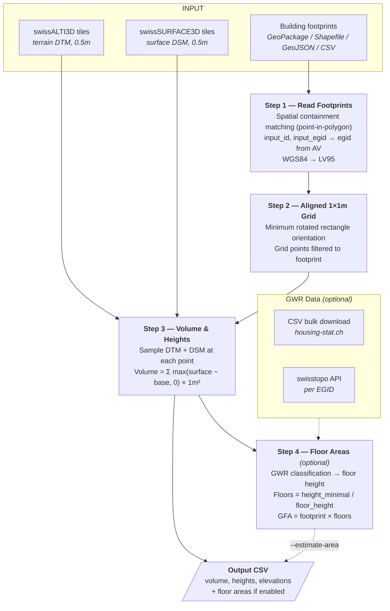

# Swiss Building Volume & Area Estimator


Estimates building volumes and gross floor areas using publicly available Swiss elevation models and cadastral data.

<p align="center">
  
  
</p>
<p align="center">
  
</p>

---

## Model Overview



---

## Command-Line Reference

| Argument | Required | Description |
|----------|:--------:|-------------|
| **Input** (one required) | | |
| `--footprints FILE` | * | Geodata file (`.gpkg`, `.shp`, `.geojson`) from Amtliche Vermessung |
| `--coordinates FILE` | * | CSV with `lon`, `lat` columns (WGS84), optionally `egid`, `fid` |
| `--geojson FILE` | * | GeoJSON with building addresses (Point + EGID) — requires `--av` |
| **Elevation data** | | |
| `--alti3d DIR` | yes | Directory with swissALTI3D GeoTIFF tiles |
| `--surface3d DIR` | yes | Directory with swissSURFACE3D GeoTIFF tiles |
| `--auto-fetch` | | Automatically download missing tiles from swisstopo |
| **AV lookup** (for `--geojson`) | | |
| `--av FILE` | with `--geojson` | AV GeoPackage (e.g. `av_2056.gpkg`) for footprint lookup |
| `--av-layer NAME` | | AV layer name (default: `lcsf`) |
| **Output** | | |
| `-o, --output FILE` | yes | Output CSV file path |
| **Filters** | | |
| `-l, --limit N` | | Process only the first N buildings |
| `-b, --bbox W S E N` | | Bounding box in WGS84 (only with `--footprints`) |
| **Area estimation** (off by default) | | |
| `--estimate-area` | | Enable Step 4: floor area estimation |
| `--gwr-csv FILE` | | GWR CSV from [housing-stat.ch](https://www.housing-stat.ch/de/data/supply/public.html); if omitted, uses swisstopo API |

---

## Examples

```bash
pip install -r python/requirements.txt
```

Process an input file (coordinates CSV):
Reads building locations from a CSV, downloads matching elevation tiles on demand, and estimates volume, heights, and floor areas using GWR classification.
```bash
python python/main.py \
    --coordinates my_buildings.csv \
    --alti3d data/swissalti3d \
    --surface3d data/swisssurface3d \
    --estimate-area --gwr-csv data/gwr/gebaeude.csv \
    -o results.csv
```

Process the full AV file with auto-fetch and floor area estimation:
Processes all buildings in the Amtliche Vermessung, automatically downloading any missing elevation tiles from swisstopo, and outputs volume, heights, and gross floor areas.
```bash
python python/main.py \
    --footprints data/bodenbedeckung.gpkg \
    --alti3d data/swissalti3d \
    --surface3d data/swisssurface3d \
    --estimate-area --gwr-csv data/gwr/gebaeude.csv \
    --auto-fetch \
    -o results.csv
```

---

## Inputs

| Column | Format | Status | Description |
|--------|--------|:------:|-------------|
| `--footprints` | `.gpkg` / `.shp` / `.geojson` | one of three | AV building polygon geodata — auto-filters to `Art = 'Gebaeude'` |
| `--coordinates` | CSV (`lon`, `lat`) | one of three | WGS84 point list — footprint buffered to 10×10 m |
| `--geojson` + `--av` | GeoJSON points + AV GeoPackage | one of three | Spatial containment match against AV polygons — no fuzzy matching |
| `--alti3d` | GeoTIFF tiles (0.5 m) | MUST | swissALTI3D terrain elevation (DTM) — [swisstopo](https://www.swisstopo.admin.ch/de/hoehenmodell-swissalti3d) |
| `--surface3d` | GeoTIFF tiles (0.5 m) | MUST | swissSURFACE3D surface elevation (DSM) — [swisstopo](https://www.swisstopo.admin.ch/de/hoehenmodell-swisssurface3d-raster) |
| `--gwr-csv` | CSV from [housing-stat.ch](https://www.housing-stat.ch/de/data/supply/public.html) | OPTIONAL | GWR building classification — required for Step 4; falls back to swisstopo API per EGID |

---

## Outputs

All results are written to a single CSV file (`result_<timestamp>.csv`).

### Step 1 — Footprints

Resolves building polygons from [Amtliche Vermessung](https://www.geodienste.ch/services/av) and reprojects to LV95 (EPSG:2056).

| Column | Format | Status | Source | Description |
|--------|--------|:------:|--------|-------------|
| `egid` | integer | MUST | AV | Authoritative federal building ID (`GWR_EGID`) |
| `fid` | integer | MUST | AV | GeoPackage feature ID |
| `area_footprint_m2` | float | MUST | Computed | Footprint area from polygon geometry (m²) |
| `area_official_m2` | float | OPTIONAL | AV | Official area from source attribute (m²) |

### Step 2 — Grid

Generates a building-oriented 1×1m sampling grid aligned to the minimum rotated rectangle of the footprint. No columns added to output CSV — grid points are consumed internally by Step 3.

<p align="center">
  
</p>

### Step 3 — Volume & Heights

Samples DTM and DSM elevations at each grid point to compute above-ground volume and height metrics.

| Column | Format | Status | Source | Description |
|--------|--------|:------:|--------|-------------|
| `volume_above_ground_m3` | float | MUST | DTM + DSM | Above-ground volume: `Σ max(surface − base, 0) × 1m²` |
| `elevation_base_m` | float | MUST | DTM | Lowest terrain point under footprint (m asl) — height reference |
| `elevation_roof_base_m` | float | MUST | DSM | Lowest surface point in footprint — estimated eave (m asl) |
| `height_mean_m` | float | MUST | DTM + DSM | Mean building height above base (m) |
| `height_max_m` | float | MUST | DTM + DSM | Max building height above base — ridge (m) |
| `height_minimal_m` | float | MUST | Computed | `volume / footprint_area` — equivalent uniform box height (m) |
| `grid_points_count` | integer | MUST | Computed | Number of valid elevation sample points |
| `status` | string | MUST | Computed | `success` / `no_building_at_point` / `no_grid_points` / `no_height_data` / `error` |

### Step 4 — Floor Areas _(optional, `--estimate-area`)_

Estimates gross floor area from GWR building classification and `height_minimal_m`. Based on the [Canton Zurich methodology](https://are.zh.ch/) (Seiler & Seiler, 2020). Floor height lookup priority: GKLAS → GKAT → default 2.70–3.30 m.

| Column | Format | Status | Source | Description |
|--------|--------|:------:|--------|-------------|
| `gkat` | integer | OPTIONAL | GWR | Building category code |
| `gklas` | integer | OPTIONAL | GWR | Building class code |
| `gbauj` | integer | OPTIONAL | GWR | Construction year |
| `gastw` | integer | OPTIONAL | GWR | Number of stories |
| `floor_height_used_m` | float | MUST | Lookup | Floor height applied (m) |
| `floors_estimated` | float | MUST | Computed | Estimated floor count |
| `area_floor_total_m2` | float | MUST | Computed | Gross floor area — `footprint × floors` (m²) |
| `area_accuracy` | string | MUST | Computed | `high` (±10–15%) / `medium` (±15–25%) / `low` (±25–40%) |

---

## Limitations

| Limitation | Detail |
|------------|--------|
| No underground estimation | LIDAR captures above-ground only; basements not included |
| Surface class merging | swissSURFACE3D merges ground, vegetation, buildings; trees over small buildings may cause overestimation |
| Small buildings | Footprints < 1 m² produce no grid points |
| Mixed-use buildings | Single floor height applied; actual heights may vary by floor |
| Industrial / special | Wide floor height ranges (4–7 m) reduce accuracy |
| Data currency | Elevation model year may not match building construction date |
| Roof base estimation | `elevation_roof_base_m` may capture ground features (overhangs, passages) instead of true eave |

---

## Project Structure

```
area-estimator/
├── python/                            ← unified pipeline (Steps 1–4)
│   ├── main.py                           CLI entry point
│   ├── footprints.py                     Step 1: load footprints / coordinates
│   ├── grid.py                           Step 2: aligned 1×1m grid
│   ├── volume.py                         Step 3: elevation sampling & volume
│   ├── tile_fetcher.py                   On-demand tile download from swisstopo
│   ├── gwr.py                            GWR lookup (CSV + API)
│   ├── area.py                           Step 4: floor area estimation
│   └── requirements.txt
├── fme/                              ← FME workbench (same as python, requires license)
├── plugins/
│   ├── roof-estimator/               ← roof shape analysis from 3D meshes
│   └── biodiversity-estimator/       ← biodiversity metrics (planned)
├── legacy/                            ← original implementations (reference)
│   ├── volume-estimator/
│   ├── area-estimator/
│   ├── base-worker/
│   └── swisstopo3d-volume_DEPRECATED/
├── data/                              ← .gitignored
│   ├── output/                           pipeline results CSV + logs
│   ├── gwr/                              GWR CSV download
│   ├── swissalti3d/                      terrain tiles
│   └── swisssurface3d/                   surface tiles
└── images/
```

---

## References

| Resource | Link |
|----------|------|
| Amtliche Vermessung | [geodienste.ch/services/av](https://www.geodienste.ch/services/av) |
| swissALTI3D | [swisstopo.admin.ch](https://www.swisstopo.admin.ch/de/hoehenmodell-swissalti3d) |
| swissSURFACE3D Raster | [swisstopo.admin.ch](https://www.swisstopo.admin.ch/de/hoehenmodell-swisssurface3d-raster) |
| swisstopo STAC API | [data.geo.admin.ch/api/stac/v1](https://data.geo.admin.ch/api/stac/v1/) |
| STAC API Docs | [geo.admin.ch/de/rest-schnittstelle-stac-api](https://www.geo.admin.ch/de/rest-schnittstelle-stac-api/) |
| swisstopo Search API | [docs.geo.admin.ch](https://docs.geo.admin.ch/access-data/search.html) |
| GWR | [housing-stat.ch](https://www.housing-stat.ch/de/index.html) |
| GWR Public Data | [housing-stat.ch/data](https://www.housing-stat.ch/de/data/supply/public.html) |
| GWR Catalog v4.3 | [housing-stat.ch/catalog](https://www.housing-stat.ch/catalog/en/4.3/final) |
| Canton Zurich Methodology | Seiler & Seiler GmbH, Dec 2020 — [are.zh.ch](https://are.zh.ch/) |
| DM.01-AV-CH Data Model | [cadastre-manual.admin.ch](https://www.cadastre-manual.admin.ch/de/datenmodell-der-amtlichen-vermessung-dm01-av-ch) |

---

## License

MIT License — see [LICENSE](LICENSE).

---

<details>
<summary>Floor height lookup table — Canton Zurich methodology (Seiler & Seiler, 2020)</summary>

EG = Erdgeschoss (ground floor), RG = Regelgeschoss (upper floors).

| Code | Building Type | Schema | EG (m) | RG (m) |
|------|---------------|--------|--------|--------|
| 1010 | Provisorische Unterkunft | GKAT | 2.70–3.30 | 2.70–3.30 |
| 1030 | Wohngebäude mit Nebennutzung | GKAT | 2.70–3.30 | 2.70–3.30 |
| 1040 | Geb. mit teilw. Wohnnutzung | GKAT | 3.30–3.70 | 2.70–3.70 |
| 1060 | Gebäude ohne Wohnnutzung | GKAT | 3.30–5.00 | 3.00–5.00 |
| 1080 | Sonderbauten | GKAT | 3.00–4.00 | 3.00–4.00 |
| 1110 | Einfamilienhaus | GKLAS | 2.70–3.30 | 2.70–3.30 |
| 1121 | Zweifamilienhaus | GKLAS | 2.70–3.30 | 2.70–3.30 |
| 1122 | Mehrfamilienhaus | GKLAS | 2.70–3.30 | 2.70–3.30 |
| 1130 | Wohngebäude f. Gemeinschaften | GKLAS | 2.70–3.30 | 2.70–3.30 |
| 1211 | Hotelgebäude | GKLAS | 3.30–3.70 | 3.00–3.50 |
| 1212 | Kurzfristige Beherbergung | GKLAS | 3.00–3.50 | 3.00–3.50 |
| 1220 | Bürogebäude | GKLAS | 3.40–4.20 | 3.40–4.20 |
| 1230 | Gross- und Einzelhandel | GKLAS | 3.40–5.00 | 3.40–5.00 |
| 1231 | Restaurants und Bars | GKLAS | 3.30–4.00 | 3.30–4.00 |
| 1241 | Bahnhöfe, Terminals | GKLAS | 4.00–6.00 | 4.00–6.00 |
| 1242 | Parkhäuser | GKLAS | 2.80–3.20 | 2.80–3.20 |
| 1251 | Industriegebäude | GKLAS | 4.00–7.00 | 4.00–7.00 |
| 1252 | Behälter, Silos, Lager | GKLAS | 3.50–6.00 | 3.50–6.00 |
| 1261 | Kultur und Freizeit | GKLAS | 3.50–5.00 | 3.50–5.00 |
| 1262 | Museen und Bibliotheken | GKLAS | 3.50–5.00 | 3.50–5.00 |
| 1263 | Schulen und Hochschulen | GKLAS | 3.30–4.00 | 3.30–4.00 |
| 1264 | Spitäler und Kliniken | GKLAS | 3.30–4.00 | 3.30–4.00 |
| 1265 | Sporthallen | GKLAS | 3.00–6.00 | 3.00–6.00 |
| 1271 | Landwirtschaftl. Betriebsgeb. | GKLAS | 3.50–5.00 | 3.50–5.00 |
| 1272 | Kirchen und Sakralbauten | GKLAS | 3.00–6.00 | 3.00–6.00 |
| 1273 | Denkmäler, geschützte Geb. | GKLAS | 3.00–4.00 | 3.00–4.00 |
| 1274 | Andere Hochbauten | GKLAS | 3.00–4.00 | 3.00–4.00 |
| — | Default (unknown) | — | 2.70–3.30 | 2.70–3.30 |

</details>
