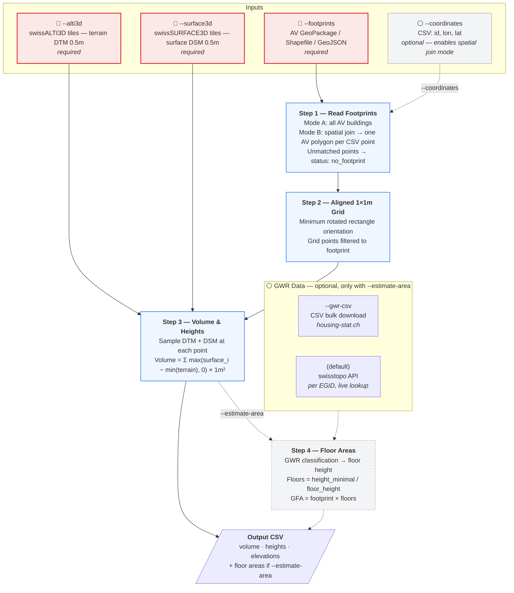

# Swiss Building Volume & Area Estimator


Estimates building volumes and gross floor areas using publicly available Swiss elevation models and cadastral data.

> **Two implementations available:** This workflow is provided as a **Python CLI** (`python/`) and as an **FME workbench** (`fme/`). Both can be downloaded and used independently. The FME version requires a licensed copy of [FME Desktop](https://fme.safe.com/).

<p align="center">
  
  
</p>
<p align="center">
  
</p>

---

## Model Overview



---

## Command-Line Reference

| Argument | Required | Description |
|----------|:--------:|-------------|
| **Input** | | |
| `--footprints FILE` | yes | Geodata file with building polygons (GeoPackage, Shapefile, or GeoJSON from AV). Alone: processes all buildings in the file. |
| `--coordinates FILE` | no | CSV with `id`, `lon`, `lat` columns (WGS84); optionally `egid` (reference only). When provided, performs a strict spatial join — only AV buildings containing a CSV point are processed. Points with no matching polygon are reported as `no_footprint` and skipped. No fallbacks. |
| **Elevation data** | | |
| `--alti3d DIR` | yes | Directory with swissALTI3D GeoTIFF tiles |
| `--surface3d DIR` | yes | Directory with swissSURFACE3D GeoTIFF tiles |
| `--auto-fetch` | | Automatically download missing tiles from swisstopo |
| **Output** | | |
| `-o, --output FILE` | | Output CSV file path (default: `data/output/result_<timestamp>.csv`) |
| **Filters** | | |
| `-l, --limit N` | | Process only the first N buildings |
| `-b, --bbox MIN_LON MIN_LAT MAX_LON MAX_LAT` | | Bounding box filter in WGS84 (only in all-buildings mode, i.e. without `--coordinates`) |
| **Area estimation** (off by default) | | |
| `--estimate-area` | | Enable Step 4: floor area estimation |
| `--gwr-csv FILE` | | GWR CSV from [housing-stat.ch](https://www.housing-stat.ch/de/data/supply/public.html); if omitted, uses swisstopo API |

---

## Examples

### Setup

```bash
pip install -r python/requirements.txt
```

### Example 1 — Portfolio list against AV footprints (spatial join)

You have a CSV of buildings (e.g. exported from a portfolio system) and a local copy
of the Amtliche Vermessung GeoPackage. The tool does a strict spatial join: each CSV
point must fall within an AV building polygon. Points with no match are skipped —
fix the coordinates in the source data, not in the code.

```bash
python python/main.py \
    --footprints "D:\AV_lv95\av_2056.gpkg" \
    --coordinates my_buildings.csv \
    --alti3d "D:\SwissAlti3D" \
    --surface3d "D:\swissSURFACE3D Raster" \
    --auto-fetch \
    -o portfolio_volumes.csv
```

### Example 2 — Process all buildings in Switzerland (AV footprints)

Download the full Amtliche Vermessung dataset from
[geodienste.ch](https://www.geodienste.ch/services/av) as a GeoPackage, and the
complete swissALTI3D + swissSURFACE3D tile sets from swisstopo. Then run:

```bash
python python/main.py \
    --footprints data/av/ch_av_2056.gpkg \
    --alti3d /data/swisstopo/swissalti3d \
    --surface3d /data/swisstopo/swisssurface3d \
    --estimate-area --gwr-csv data/gwr/buildings.csv \
    -o results/ch_all_buildings.csv
```

This processes ~2.5 million buildings. For a first test run, limit to a small batch:

```bash
python python/main.py \
    --footprints data/av/ch_av_2056.gpkg \
    --alti3d /data/swisstopo/swissalti3d \
    --surface3d /data/swisstopo/swisssurface3d \
    --limit 100
```

To process a specific region (e.g. City of Bern), use a bounding box filter:

```bash
python python/main.py \
    --footprints data/av/ch_av_2056.gpkg \
    --alti3d /data/swisstopo/swissalti3d \
    --surface3d /data/swisstopo/swisssurface3d \
    --bbox 7.40 46.93 7.48 46.97 \
    --estimate-area --gwr-csv data/gwr/buildings.csv \
    -o results/bern_buildings.csv
```

### Example 3 — Quick test with auto-fetch

No local elevation data needed — the tool downloads tiles on-the-fly from swisstopo:

```bash
python python/main.py \
    --footprints data/av/ch_av_2056.gpkg \
    --coordinates my_buildings.csv \
    --alti3d data/swissalti3d \
    --surface3d data/swisssurface3d \
    --auto-fetch \
    --limit 10
```

---

## Inputs

### Required Data

| Data | Format | Required | Download | Description |
|------|--------|:--------:|----------|-------------|
| AV footprints | GeoPackage | yes | [geodienste.ch/services/av](https://www.geodienste.ch/services/av) | Building polygons from Amtliche Vermessung (`--footprints`). Layer `lcsf`, filtered to `Art = Gebaeude`. |
| Building coordinates | `.csv` | no | — | List of points for spatial join against AV (`--coordinates`); omit to process all buildings in the AV file |
| swissALTI3D | GeoTIFF tiles (0.5 m) | yes | [swisstopo.admin.ch](https://www.swisstopo.admin.ch/de/hoehenmodell-swissalti3d) | Terrain elevation model (DTM). Can be auto-downloaded with `--auto-fetch`. |
| swissSURFACE3D Raster | GeoTIFF tiles (0.5 m) | yes | [swisstopo.admin.ch](https://www.swisstopo.admin.ch/de/hoehenmodell-swisssurface3d-raster) | Surface elevation model (DSM). Can be auto-downloaded with `--auto-fetch`. |
| GWR (Federal Register of Buildings) | `.csv` | with `--estimate-area` | [housing-stat.ch/data](https://www.housing-stat.ch/de/data/supply/public.html) | Building classification for floor height lookup. Falls back to swisstopo API per EGID if omitted. |

### Input Columns (coordinates CSV, `--coordinates`)

| Column | Required | Description |
|--------|----------|-------------|
| `id` | yes | Building reference ID — preserved as `input_id` in output |
| `lon` | yes | WGS84 longitude |
| `lat` | yes | WGS84 latitude |
| `egid` | no | Federal building ID — preserved as `input_egid` for reference only; not used for matching |

Points that do not fall within any AV building polygon result in `status_step1 = no_footprint` and are skipped. Coordinate accuracy must be sufficient for the point to lie inside the polygon — no tolerance or fallback is applied.

---

## Outputs

All results are written to a single CSV file (`result_<timestamp>.csv`).

### Step 1 — Footprints

Two modes, automatically selected based on which flags are provided:

- **AV only** (`--footprints`): Loads all building polygons from the geodata file and filters to buildings (looks for `Gebaeude` / `building` in the type column). Converts to LV95 if needed. The `egid` column is renamed to `av_egid`; each feature gets a `fid`.
- **AV + CSV** (`--footprints` + `--coordinates`): Strict spatial join — each CSV point must fall within an AV building polygon. No fallbacks. Rows with no match get `status_step1 = no_footprint` and are skipped; fix the coordinates in the source data.

| Column | Format | Required | Source | Description |
|--------|--------|:--------:|--------|-------------|
| `area_official_m2` | float | no | AV source | Official area from AV source data (m²); `null` in CSV-only mode |
| `status_step1` | string | yes | Computed | `ok` / `no_footprint` |

### Step 2 — Grid

Fills each building footprint with a 1×1 m grid of sample points. The grid is rotated to align with the building's longest edge (using the minimum bounding rectangle), so it fits tightly even for angled buildings. These grid points are used internally by Step 3 — no columns are added to the output CSV.

<p align="center">
  
</p>

### Step 3 — Volume & Heights

At each 1×1 m grid point, the tool reads two elevations: the ground level (DTM) and the surface level including buildings/trees (DSM). The above-ground height at each point is measured from the lowest terrain elevation under the building (`elevation_base_min_m`) as a flat horizontal datum — `max(surface_i − min(terrain), 0)`. This keeps the base plane consistent across sloped sites. Volume is the sum of all those heights, each representing 1 m².

| Column | Format | Required | Source | Description |
|--------|--------|:--------:|--------|-------------|
| `area_footprint_m2` | float | yes | Computed | Footprint area computed from AV polygon geometry (m²) |
| `volume_above_ground_m3` | float | yes | DTM + DSM | Total above-ground volume: `Σ max(surface_i − min(terrain), 0) × 1 m²` — measured from the lowest ground point as a flat base datum |
| `elevation_base_min_m` | float | yes | DTM | Lowest ground elevation under the building — used as the volume base datum (m a.s.l.) |
| `elevation_base_mean_m` | float | yes | DTM | Mean ground elevation under the building (m a.s.l.) |
| `elevation_base_max_m` | float | yes | DTM | Highest ground elevation under the building (m a.s.l.) |
| `elevation_roof_min_m` | float | yes | DSM | Lowest surface elevation within footprint — typically the eave / gutter (m a.s.l.) |
| `elevation_roof_mean_m` | float | yes | DSM | Mean surface elevation within footprint (m a.s.l.) |
| `elevation_roof_max_m` | float | yes | DSM | Highest surface elevation within footprint — typically the ridge (m a.s.l.) |
| `height_mean_m` | float | yes | DTM + DSM | Average above-ground height across all grid points, measured from `elevation_base_min_m` (m) |
| `height_max_m` | float | yes | DTM + DSM | Tallest above-ground point — usually the roof ridge (m) |
| `height_minimal_m` | float | yes | Computed | `volume ÷ footprint area` — the height a simple box with the same footprint would need to match the building's volume (m) |
| `grid_points_count` | integer | yes | Computed | Number of grid points where both DTM and DSM data were available |
| `status_step3` | string | yes | Computed | `success` / `skipped:<status_step1>` (e.g. `skipped:no_footprint`) / `no_grid_points` / `no_height_data` / `error` |

### Step 4 — Floor Areas _(optional, `--estimate-area`)_

Estimates gross floor area by dividing building height by a typical floor height for that building type. The building type comes from the GWR (Federal Register of Buildings), which classifies every Swiss building. The tool looks up the floor height in this order: first by the specific building class (GKLAS, e.g. "Office building" → 3.80 m), then by the broader category (GKAT, e.g. "Non-residential" → 4.15 m), and falls back to a default of 3.00 m if no classification is available. Based on the [Canton Zurich methodology](https://are.zh.ch/) (Seiler & Seiler, 2020).

| Column | Format | Required | Source | Description |
|--------|--------|:--------:|--------|-------------|
| `gkat` | integer | no, from GWR | GWR | Building category code (broad, e.g. 1020 = Residential) |
| `gklas` | integer | no, from GWR | GWR | Building class code (specific, e.g. 1110 = Single-family house) |
| `gbauj` | integer | no, from GWR | GWR | Construction year |
| `gastw` | integer | no, from GWR | GWR | Number of stories (from register, not estimated) |
| `floor_height_used_m` | float | yes | Lookup | Floor height used for estimation — average of the min/max range for this building type (m) |
| `floors_estimated` | integer | yes | Computed | Estimated number of floors: `height_minimal ÷ floor_height`, rounded |
| `area_floor_total_m2` | float | yes | Computed | Gross floor area: `footprint area × estimated floors` (m²) |
| `area_accuracy` | string | yes | Computed | `high` (±10–15%) / `medium` (±15–25%) / `low` (±25–40%) — based on how well-defined the floor height is for this building type |
| `building_type` | string | yes | Lookup | Human-readable building type from floor height lookup (e.g. `Single-family house`) |
| `status_step4` | string | yes | Computed | `success` / `skipped` / `no_volume` / `height_exceeds_200m` |

---

## Limitations

| Limitation | Detail |
|------------|--------|
| No underground estimation | LIDAR only sees above ground — basements and underground floors are not included |
| Trees over buildings | The surface model doesn't distinguish roofs from foliage — tall trees over small buildings inflate the measured height and volume |
| Surface model merging | swissSURFACE3D combines ground, vegetation, and buildings into one surface; this can cause overestimation near vegetation |
| Small buildings | Footprints smaller than 1 m² produce no grid points and can't be measured |
| Mixed-use buildings | A single floor height is applied per building; actual floor heights may vary (e.g. retail ground floor + residential upper floors) |
| Industrial / special buildings | Floor height ranges are wide (4–7 m), so floor count estimates are less reliable |
| Data timing | The elevation model may have been captured before or after the building was constructed or modified |
| Roof eave estimation | `elevation_roof_min_m` picks the lowest surface point, which may hit ground-level features (overhangs, passages) rather than the actual roof edge |
| Sloped terrain | Volume is measured from `elevation_base_min_m` (the lowest terrain point) as a flat datum. On steeply sloped sites, this includes terrain undulation between the low and high sides of the building. |
| Duplicate footprints (CSV mode) | If multiple CSV coordinates fall within the same AV building polygon, each match produces a separate output row with the same volume. The total volume cannot be derived by simply summing the output — deduplicate by `av_egid` or `fid` first if you need building-level aggregation. |

---

## Future Development

| Feature | Description |
|---------|-------------|
| Watertight 3D mesh | Generate closed building geometry from elevation data. swisstopo provides an official 3D buildings dataset (swissBUILDINGS3D), but quality varies significantly between buildings. |
| Roof geometry estimation | Classify roof shapes (flat, gable, hip, etc.) and estimate roof surface areas from 3D mesh or elevation profiles. |
| Outer wall quantities | Estimate exterior wall areas from building footprint perimeter and height metrics. |
| Material classification | Investigate building material detection from imagery or other data sources — expected to be challenging. |
| International buildings | Extend support beyond Switzerland. The Swiss federal real estate portfolio includes buildings worldwide, requiring alternative elevation and cadastral data sources. |

---

## Project Structure

```
area-estimator/
├── python/                            ← unified pipeline (Steps 1–4)
│   ├── main.py                           CLI entry point
│   ├── footprints.py                     Step 1: load footprints / coordinates
│   ├── grid.py                           Step 2: aligned 1×1m grid
│   ├── volume.py                         Step 3: elevation sampling & volume
│   ├── tile_fetcher.py                   On-demand tile download from swisstopo
│   ├── gwr.py                            GWR lookup (CSV + API)
│   ├── area.py                           Step 4: floor area estimation
│   └── requirements.txt
├── fme/                              ← FME workbench (same as python, requires license)
├── tools/
│   ├── roof-estimator/               ← roof shape analysis from 3D meshes
│   └── green-roof-eval/              ← green roof detection (FME-based)
├── legacy/                            ← original implementations (reference)
│   ├── volume-estimator/
│   ├── area-estimator/
│   ├── base-worker/
│   └── swisstopo3d-volume_DEPRECATED/
├── data/                              ← .gitignored
│   ├── output/                           pipeline results CSV + logs
│   ├── gwr/                              GWR CSV download
│   ├── swissalti3d/                      terrain tiles
│   └── swisssurface3d/                   surface tiles
└── images/
```

---

## Floor Height Lookup

| Code | Building Type | Schema | GF (m) | UF (m) |
|------|---------------|--------|--------|--------|
| 1010 | Provisional shelter | GKAT | 2.70–3.30 | 2.70–3.30 |
| 1030 | Residential with secondary use | GKAT | 2.70–3.30 | 2.70–3.30 |
| 1040 | Partially residential | GKAT | 3.30–3.70 | 2.70–3.70 |
| 1060 | Non-residential | GKAT | 3.30–5.00 | 3.00–5.00 |
| 1080 | Special-purpose | GKAT | 3.00–4.00 | 3.00–4.00 |
| 1110 | Single-family house | GKLAS | 2.70–3.30 | 2.70–3.30 |
| 1121 | Two-family house | GKLAS | 2.70–3.30 | 2.70–3.30 |
| 1122 | Multi-family house | GKLAS | 2.70–3.30 | 2.70–3.30 |
| 1130 | Community residential | GKLAS | 2.70–3.30 | 2.70–3.30 |
| 1211 | Hotel | GKLAS | 3.30–3.70 | 3.00–3.50 |
| 1212 | Short-term accommodation | GKLAS | 3.00–3.50 | 3.00–3.50 |
| 1220 | Office building | GKLAS | 3.40–4.20 | 3.40–4.20 |
| 1230 | Wholesale and retail | GKLAS | 3.40–5.00 | 3.40–5.00 |
| 1231 | Restaurants and bars | GKLAS | 3.30–4.00 | 3.30–4.00 |
| 1241 | Stations and terminals | GKLAS | 4.00–6.00 | 4.00–6.00 |
| 1242 | Parking garages | GKLAS | 2.80–3.20 | 2.80–3.20 |
| 1251 | Industrial building | GKLAS | 4.00–7.00 | 4.00–7.00 |
| 1252 | Tanks, silos, warehouses | GKLAS | 3.50–6.00 | 3.50–6.00 |
| 1261 | Culture and leisure | GKLAS | 3.50–5.00 | 3.50–5.00 |
| 1262 | Museums and libraries | GKLAS | 3.50–5.00 | 3.50–5.00 |
| 1263 | Schools and universities | GKLAS | 3.30–4.00 | 3.30–4.00 |
| 1264 | Hospitals and clinics | GKLAS | 3.30–4.00 | 3.30–4.00 |
| 1265 | Sports halls | GKLAS | 3.00–6.00 | 3.00–6.00 |
| 1271 | Agricultural buildings | GKLAS | 3.50–5.00 | 3.50–5.00 |
| 1272 | Churches and religious buildings | GKLAS | 3.00–6.00 | 3.00–6.00 |
| 1273 | Monuments and protected buildings | GKLAS | 3.00–4.00 | 3.00–4.00 |
| 1274 | Other structures | GKLAS | 3.00–4.00 | 3.00–4.00 |
| — | Default (unknown) | — | 2.70–3.30 | 2.70–3.30 |

---

## References

| Resource | Link |
|----------|------|
| Amtliche Vermessung (AV) | [geodienste.ch/services/av](https://www.geodienste.ch/services/av) |
| swissALTI3D | [swisstopo.admin.ch](https://www.swisstopo.admin.ch/de/hoehenmodell-swissalti3d) |
| swissSURFACE3D Raster | [swisstopo.admin.ch](https://www.swisstopo.admin.ch/de/hoehenmodell-swisssurface3d-raster) |
| swisstopo STAC API | [data.geo.admin.ch/api/stac/v1](https://data.geo.admin.ch/api/stac/v1/) |
| STAC API Docs | [geo.admin.ch/de/rest-schnittstelle-stac-api](https://www.geo.admin.ch/de/rest-schnittstelle-stac-api/) |
| swisstopo Search API | [docs.geo.admin.ch](https://docs.geo.admin.ch/access-data/search.html) |
| GWR | [housing-stat.ch](https://www.housing-stat.ch/de/index.html) |
| GWR Public Data | [housing-stat.ch/data](https://www.housing-stat.ch/de/data/supply/public.html) |
| GWR Catalog v4.3 | [housing-stat.ch/catalog](https://www.housing-stat.ch/catalog/en/4.3/final) |
| Canton Zurich Methodology | Seiler & Seiler GmbH, Dec 2020 — [are.zh.ch](https://are.zh.ch/) |
| DM.01-AV-CH Data Model | [cadastre-manual.admin.ch](https://www.cadastre-manual.admin.ch/de/datenmodell-der-amtlichen-vermessung-dm01-av-ch) |

---

## License

MIT License — see [LICENSE](LICENSE).
