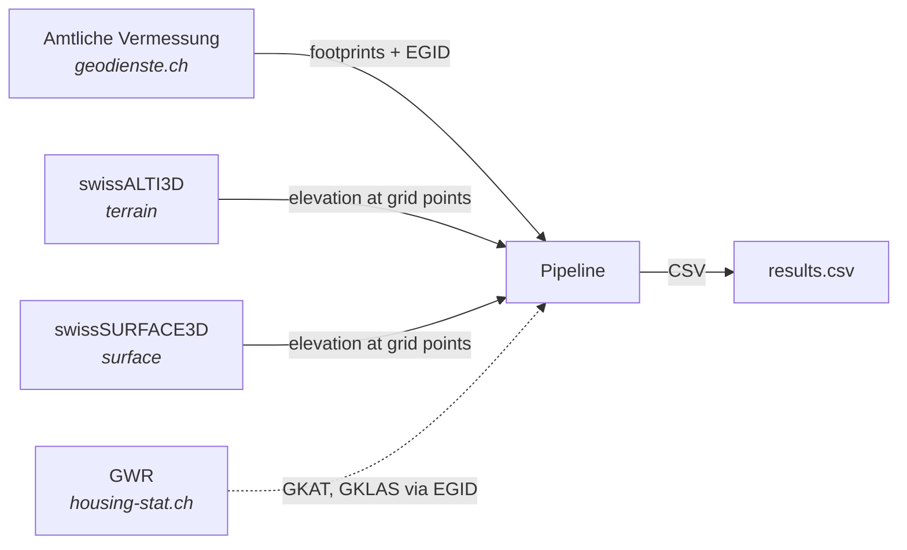
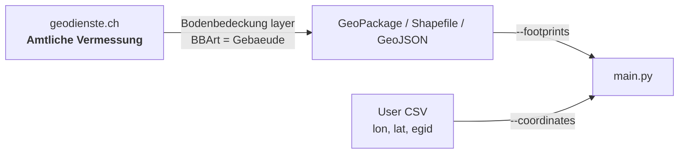
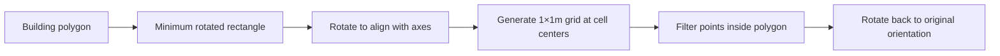
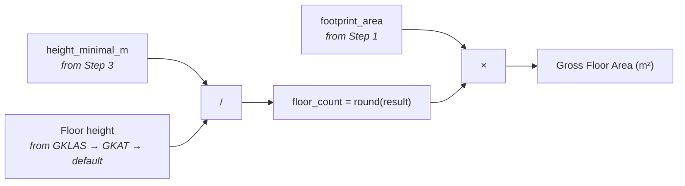

# Swiss Building Volume & Area Estimator


Estimates building volumes and gross floor areas using publicly available Swiss elevation models and cadastral data.

<p align="center">
  
  
</p>
<p align="center">
  
</p>

## Model Overview


### Data flow



---

## Quick Start

### Install

```bash
pip install -r python/requirements.txt
```

### Process buildings from Amtliche Vermessung

```bash
python python/main.py \
    --footprints data/bodenbedeckung.gpkg \
    --alti3d data/swissalti3d \
    --surface3d data/swisssurface3d \
    -o results.csv
```

### Process a list of coordinates

```bash
python python/main.py \
    --coordinates my_buildings.csv \
    --alti3d data/swissalti3d \
    --surface3d data/swisssurface3d \
    -o results.csv
```

Where `my_buildings.csv` contains:

```csv
lon,lat,egid
7.4474,46.9480,1234567
7.4512,46.9495,2345678
```

### With filters

```bash
# Bounding box (WGS84)
python python/main.py --footprints data/bodenbedeckung.gpkg \
    --alti3d data/swissalti3d --surface3d data/swisssurface3d \
    --bbox 7.43 47.15 7.48 47.19 -o zurich_sample.csv

# First N buildings
python python/main.py --footprints data/bodenbedeckung.gpkg \
    --alti3d data/swissalti3d --surface3d data/swisssurface3d \
    --limit 100 -o first_100.csv
```

### With floor area estimation (Step 4)

```bash
# Bulk GWR CSV (recommended for large batches)
python python/main.py --footprints data/bodenbedeckung.gpkg \
    --alti3d data/swissalti3d --surface3d data/swisssurface3d \
    --estimate-area --gwr-csv data/gwr/gebaeude.csv \
    -o results_with_areas.csv

# swisstopo API fallback (for small batches)
python python/main.py --coordinates my_buildings.csv \
    --alti3d data/swissalti3d --surface3d data/swisssurface3d \
    --estimate-area -o results_with_areas.csv
```

---

## Command-Line Reference

| Argument | Required | Description |
|----------|:--------:|-------------|
| **Input** (one required) | | |
| `--footprints FILE` | * | Geodata file (`.gpkg`, `.shp`, `.geojson`) from Amtliche Vermessung |
| `--coordinates FILE` | * | CSV with `lon`, `lat` columns (WGS84), optionally `egid`, `fid` |
| **Elevation data** | | |
| `--alti3d DIR` | yes | Directory with swissALTI3D GeoTIFF tiles |
| `--surface3d DIR` | yes | Directory with swissSURFACE3D GeoTIFF tiles |
| **Output** | | |
| `-o, --output FILE` | yes | Output CSV file path |
| **Filters** | | |
| `-l, --limit N` | | Process only the first N buildings |
| `-b, --bbox W S E N` | | Bounding box in WGS84 (only with `--footprints`) |
| **Area estimation** (off by default) | | |
| `--estimate-area` | | Enable Step 4: floor area estimation |
| `--gwr-csv FILE` | | GWR CSV from [housing-stat.ch](https://www.housing-stat.ch/de/data/supply/public.html); if omitted, uses swisstopo API |

---

## Input Data

### 1. Building Footprints



| Property | Value |
|----------|-------|
| Source | [geodienste.ch/services/av](https://www.geodienste.ch/services/av) |
| Layer | Bodenbedeckung, filtered to `BBArt = Gebaeude` |
| Identifiers | **EGID** (federal building ID) + **FID** (cadastral survey feature ID) |
| Formats | GeoPackage (`.gpkg`), Shapefile (`.shp`), GeoJSON (`.geojson`), or CSV with `lon`/`lat` |
| Data model | [DM.01-AV-CH](https://www.cadastre-manual.admin.ch/de/datenmodell-der-amtlichen-vermessung-dm01-av-ch) |

### 2. Elevation Models

| Dataset | Type | Measures | Resolution | Download |
|---------|------|----------|:----------:|----------|
| **swissALTI3D** | DTM (terrain) | Bare earth elevation | 0.5 m | [swisstopo](https://www.swisstopo.admin.ch/de/hoehenmodell-swissalti3d) |
| **swissSURFACE3D** | DSM (surface) | Top of buildings, vegetation | 0.5 m | [swisstopo](https://www.swisstopo.admin.ch/de/hoehenmodell-swisssurface3d-raster) |

GeoTIFF tiles in LV95 (EPSG:2056), named by grid position:

```
swissalti3d_YYYY_XXXX-YYYY_0.5_2056_5728.tif
swisssurface3d-raster_YYYY_XXXX-YYYY_0.5_2056_5728.tif
```

> Tile ID `XXXX-YYYY` = SW corner ÷ 1000. Example: `2609-1176` covers E 2609000–2610000, N 1176000–1177000.

### 3. GWR Classification (optional)

Required only for Step 4 (`--estimate-area`). Links to buildings via EGID.

| Property | Value |
|----------|-------|
| Source | [housing-stat.ch](https://www.housing-stat.ch/de/index.html) |
| Catalog | [GWR v4.3](https://www.housing-stat.ch/catalog/en/4.3/final) |
| Key fields | `GKAT` (category), `GKLAS` (class), `GBAUJ` (year), `GASTW` (stories) |

| Access method | Use case |
|---------------|----------|
| **CSV bulk download** | All of Switzerland — [housing-stat.ch/data](https://www.housing-stat.ch/de/data/supply/public.html) |
| **swisstopo API** | Individual lookups by EGID — [docs](https://docs.geo.admin.ch/access-data/search.html) |

<details>
<summary>swisstopo API example</summary>

```http
# 1. Search by EGID
GET https://api3.geo.admin.ch/rest/services/ech/SearchServer
    ?searchText={EGID}&type=locations&origins=address

# 2. Get full attributes by feature ID
GET https://api3.geo.admin.ch/rest/services/ech/MapServer
    /ch.bfs.gebaeude_wohnungs_register/{featureId}
```

Returns: `egid`, `gkat`, `gklas`, `gbauj`, `gastw`, `garea`, `ganzwhg`, `egrid`.

</details>

---

## Pipeline Details

### Step 1 — Read Building Footprints

Loads building polygons from a geodata file or CSV coordinates. Each building carries:
- **EGID** — links to GWR attributes
- **FID** — cadastral survey feature ID
- **area_official_m2** — official area from source (if present), kept for reference
- **area_footprint_m2** — always computed from `polygon.area` for consistency

All geometries are transformed to LV95 (EPSG:2056).

| Input mode | Flag | Accepts |
|------------|------|---------|
| Geodata file | `--footprints` | `.gpkg`, `.shp`, `.geojson` — auto-filters to buildings if type column present |
| Coordinates | `--coordinates` | CSV with `lon`, `lat` (optionally `egid`, `fid`) — each point is buffered into a 10×10 m polygon for elevation sampling |

### Step 2 — Aligned 1×1m Grid



Why oriented grids? A 45°-rotated building gets poor coverage from an axis-aligned grid. Aligning to building edges maximizes valid sample points.

### Step 3 — Volume & Height Metrics

Samples two elevation values at each grid point:

| Value | Source | Meaning |
|-------|--------|---------|
| Terrain | swissALTI3D (DTM) | Ground elevation |
| Surface | swissSURFACE3D (DSM) | Top of building |

**Volume calculation:**

```
base_height     = min(terrain)                         # lowest ground under building
building_height = max(surface − base_height, 0)        # per grid point
volume          = Σ(building_heights) × 1m²
```

**Derived height metrics:**

| Metric | Formula | Purpose |
|--------|---------|---------|
| `height_mean_m` | mean(building_heights) | Average height across grid |
| `height_max_m` | max(building_heights) | Tallest point |
| `height_minimal_m` | volume / footprint | Equivalent uniform box height — best for floor estimation on complex shapes |
| `elevation_base_m` | min(terrain) | Lowest ground point |
| `elevation_roof_base_m` | min(surface) | Estimated eave / roof base elevation |

### Step 4 — Floor Area Estimation (optional)

Enabled with `--estimate-area`. Based on the [Canton Zurich methodology](https://are.zh.ch/) (Seiler & Seiler, 2020).



Uses `height_minimal_m` (volume / footprint) rather than `height_mean_m` — it represents the equivalent uniform box height, smoothing out complex roof shapes and dormers.

**Lookup priority:** GKLAS (specific class) → GKAT (broad category) → default 2.70–3.30 m.

---

## Output CSV

### Always included (Steps 1–3)

| Column | Source | Description |
|--------|--------|-------------|
| `egid` | AV | Federal building identifier |
| `fid` | AV | Cadastral survey feature ID |
| `area_footprint_m2` | Geometry | Footprint area computed from polygon (m²) |
| `area_official_m2` | AV | Official area attribute from source data (m², if available) |
| `volume_above_ground_m3` | DTM + DSM | Above-ground volume (m³) |
| `elevation_base_m` | DTM | Min terrain elevation (m, LV95) |
| `elevation_roof_base_m` | DSM | Min surface elevation — est. eave (m, LV95) |
| `height_mean_m` | DTM + DSM | Mean building height (m) |
| `height_max_m` | DTM + DSM | Max building height (m) |
| `height_minimal_m` | Derived | volume / footprint (m) |
| `grid_points_count` | — | Valid elevation sample points |
| `status` | — | `success` / `no_grid_points` / `no_height_data` / `error` |

### With `--estimate-area` (Step 4)

| Column | Source | Description |
|--------|--------|-------------|
| `gkat` | GWR | Building category code |
| `gklas` | GWR | Building class code |
| `gbauj` | GWR | Construction year |
| `gastw` | GWR | Number of stories (GWR value) |
| `area_floor_total_m2` | Derived | Gross floor area (m²) |
| `floors_estimated` | Derived | Estimated floor count |
| `floor_height_used_m` | Derived | Floor height applied (m) |
| `building_type` | GWR | Building type description |
| `area_accuracy` | Derived | `high` / `medium` / `low` |

### Accuracy levels

| Level | Uncertainty | Building types |
|:-----:|:-----------:|----------------|
| **high** | ±10–15% | Residential (GKAT 1020, GKLAS 11xx) |
| **medium** | ±15–25% | Commercial, office, schools, hospitals |
| **low** | ±25–40% | Industrial, special use, missing classification |

---

## Floor Height Reference

<details>
<summary>Full lookup table — Canton Zurich methodology (Seiler & Seiler, 2020)</summary>

EG = Erdgeschoss (ground floor), RG = Regelgeschoss (upper floors).

| Code | Building Type | Schema | EG (m) | RG (m) |
|------|---------------|--------|--------|--------|
| 1010 | Provisorische Unterkunft | GKAT | 2.70–3.30 | 2.70–3.30 |
| 1030 | Wohngebäude mit Nebennutzung | GKAT | 2.70–3.30 | 2.70–3.30 |
| 1040 | Geb. mit teilw. Wohnnutzung | GKAT | 3.30–3.70 | 2.70–3.70 |
| 1060 | Gebäude ohne Wohnnutzung | GKAT | 3.30–5.00 | 3.00–5.00 |
| 1080 | Sonderbauten | GKAT | 3.00–4.00 | 3.00–4.00 |
| 1110 | Einfamilienhaus | GKLAS | 2.70–3.30 | 2.70–3.30 |
| 1121 | Zweifamilienhaus | GKLAS | 2.70–3.30 | 2.70–3.30 |
| 1122 | Mehrfamilienhaus | GKLAS | 2.70–3.30 | 2.70–3.30 |
| 1130 | Wohngebäude f. Gemeinschaften | GKLAS | 2.70–3.30 | 2.70–3.30 |
| 1211 | Hotelgebäude | GKLAS | 3.30–3.70 | 3.00–3.50 |
| 1212 | Kurzfristige Beherbergung | GKLAS | 3.00–3.50 | 3.00–3.50 |
| 1220 | Bürogebäude | GKLAS | 3.40–4.20 | 3.40–4.20 |
| 1230 | Gross- und Einzelhandel | GKLAS | 3.40–5.00 | 3.40–5.00 |
| 1231 | Restaurants und Bars | GKLAS | 3.30–4.00 | 3.30–4.00 |
| 1241 | Bahnhöfe, Terminals | GKLAS | 4.00–6.00 | 4.00–6.00 |
| 1242 | Parkhäuser | GKLAS | 2.80–3.20 | 2.80–3.20 |
| 1251 | Industriegebäude | GKLAS | 4.00–7.00 | 4.00–7.00 |
| 1252 | Behälter, Silos, Lager | GKLAS | 3.50–6.00 | 3.50–6.00 |
| 1261 | Kultur und Freizeit | GKLAS | 3.50–5.00 | 3.50–5.00 |
| 1262 | Museen und Bibliotheken | GKLAS | 3.50–5.00 | 3.50–5.00 |
| 1263 | Schulen und Hochschulen | GKLAS | 3.30–4.00 | 3.30–4.00 |
| 1264 | Spitäler und Kliniken | GKLAS | 3.30–4.00 | 3.30–4.00 |
| 1265 | Sporthallen | GKLAS | 3.00–6.00 | 3.00–6.00 |
| 1271 | Landwirtschaftl. Betriebsgeb. | GKLAS | 3.50–5.00 | 3.50–5.00 |
| 1272 | Kirchen und Sakralbauten | GKLAS | 3.00–6.00 | 3.00–6.00 |
| 1273 | Denkmäler, geschützte Geb. | GKLAS | 3.00–4.00 | 3.00–4.00 |
| 1274 | Andere Hochbauten | GKLAS | 3.00–4.00 | 3.00–4.00 |
| — | Default (unknown) | — | 2.70–3.30 | 2.70–3.30 |

</details>

---

## Limitations

| Limitation | Detail |
|------------|--------|
| No underground estimation | LIDAR captures above-ground only; basements not included |
| Surface class merging | swissSURFACE3D merges ground, vegetation, buildings; trees over small buildings may cause overestimation |
| Small buildings | Footprints < 1 m² produce no grid points |
| Mixed-use buildings | Single floor height applied; actual heights may vary by floor |
| Industrial / special | Wide floor height ranges (4–7 m) reduce accuracy |
| Data currency | Elevation model year may not match building construction date |
| Roof base estimation | `elevation_roof_base_m` may capture ground features (overhangs, passages) instead of true eave |

---

## Project Structure

```
area-estimator/
├── python/                            ← unified pipeline (Steps 1–4)
│   ├── main.py                           CLI entry point
│   ├── footprints.py                     Step 1: load footprints / coordinates
│   ├── grid.py                           Step 2: aligned 1×1m grid
│   ├── volume.py                         Step 3: elevation sampling & volume
│   ├── gwr.py                            GWR lookup (CSV + API)
│   ├── area.py                           Step 4: floor area estimation
│   └── requirements.txt
├── plugins/
│   ├── roof-estimator/                ← roof shape analysis from 3D meshes
│   └── biodiversity-estimator/        ← biodiversity metrics (planned)
├── legacy/                            ← original implementations (reference)
│   ├── volume-estimator/
│   ├── area-estimator/
│   ├── base-worker/
│   └── swisstopo3d-volume_DEPRECATED/
├── data/                              ← .gitignored
│   ├── gwr/                              GWR CSV download
│   ├── swissalti3d/                      terrain tiles
│   └── swisssurface3d/                   surface tiles
└── images/
```

---

## References

| Resource | Link |
|----------|------|
| Amtliche Vermessung | [geodienste.ch/services/av](https://www.geodienste.ch/services/av) |
| swissALTI3D | [swisstopo.admin.ch](https://www.swisstopo.admin.ch/de/hoehenmodell-swissalti3d) |
| swissSURFACE3D | [swisstopo.admin.ch](https://www.swisstopo.admin.ch/de/hoehenmodell-swisssurface3d-raster) |
| swisstopo Search API | [docs.geo.admin.ch](https://docs.geo.admin.ch/access-data/search.html) |
| GWR | [housing-stat.ch](https://www.housing-stat.ch/de/index.html) |
| GWR Public Data | [housing-stat.ch/data](https://www.housing-stat.ch/de/data/supply/public.html) |
| GWR Catalog v4.3 | [housing-stat.ch/catalog](https://www.housing-stat.ch/catalog/en/4.3/final) |
| Canton Zurich Methodology | Seiler & Seiler GmbH, Dec 2020 — [are.zh.ch](https://are.zh.ch/) |
| DM.01-AV-CH Data Model | [cadastre-manual.admin.ch](https://www.cadastre-manual.admin.ch/de/datenmodell-der-amtlichen-vermessung-dm01-av-ch) |

---

## License

MIT License — see [LICENSE](LICENSE).
