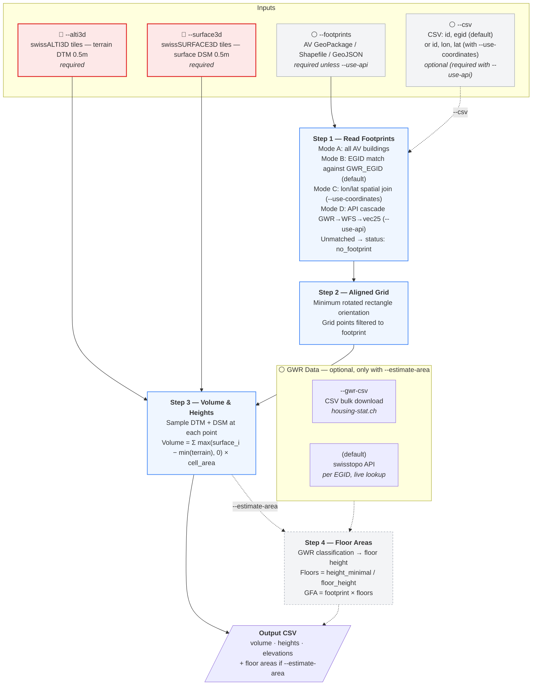

# Swiss Building Volume & Area Estimator — Technical Specification

Cross-cutting reference for the processing pipeline shared by all three solutions ([Web App](../webapp/), [Python CLI](../python/), [FME](../fme/)). For implementation-level detail — command-line flags, output columns, accuracy buckets, and the full floor-height lookup — see [python/README.md](../python/README.md).

## Goal

Estimate the above-ground **volume** and **gross floor area** of a Swiss building from public elevation and cadastral data. The input is a list of buildings (by EGID); the output is, per building, a volume, a set of height/elevation metrics, and — optionally — an estimated floor count and gross floor area.

All processing is done in CRS LV95 (EPSG:2056).

---

## Pipeline overview



> **Note:** The flowchart describes the Python CLI pipeline. With `--use-api`, Step 1 fetches footprints from public APIs instead of a local file (GWR → geodienste.ch WFS → swisstopo vec25 cascade). The Web App follows the same 4 steps and the same API cascade. The FME workbench implements Steps 1–3 only (no floor-area estimation).

## The four steps

1. **Read footprints** — Load each building's footprint polygon, either from a local AV file (by EGID match, or by lon/lat spatial join with `--use-coordinates`) or via the API cascade (`--use-api`: GWR → geodienste.ch WFS → swisstopo vec25). Unmatched buildings are flagged `no_footprint`.
2. **Aligned grid** — Fill each footprint with a grid of sample points rotated to the building's longest edge (minimum rotated rectangle), so it fits tightly even for angled buildings. 1×1 m in the Python CLI, 2×2 m in the Web App.
3. **Volume & heights** — At each grid point, sample terrain (DTM) and surface (DSM) elevations. Above-ground height is measured from the lowest terrain point under the building as a flat datum: `max(surface_i − min(terrain), 0)`. Volume is the sum of those heights × cell area.
4. **Floor areas** *(optional)* — Look up the building's GWR classification, pick a typical floor height for that building type, derive a floor count, and multiply by footprint area for gross floor area.

The per-step **output column schema**, the **floor-height lookup table**, and the **accuracy buckets** are documented in [python/README.md](../python/README.md).

---

## AV vs GWR

The pipeline uses two distinct Swiss data registers, linked by the `GWR_EGID` attribute:

- **AV (Amtliche Vermessung)** — the cadastral survey, providing building **geometry** (parcel and footprint polygons). Maintained by cantonal survey offices, available via [geodienste.ch](https://www.geodienste.ch/).
- **GWR (Gebäude- und Wohnungsregister)** — the federal building register, providing building **master data**: addresses, classification, construction year, dwelling counts. Maintained by the Federal Statistical Office, available via the [BFS](https://www.bfs.admin.ch/) and [swisstopo APIs](https://api3.geo.admin.ch/).

AV polygons supply the footprint geometry (needed by Steps 1–3 to compute volume); GWR classification drives Step 4 (converting volume to floor area). EGID is the natural key. A few percent of AV building polygons have no EGID assigned, which is why coordinate-based matching is kept as an option (`--use-coordinates`).

---

## Limitations

| Limitation | Detail |
|------------|--------|
| No underground estimation | LIDAR only sees above ground — basements and underground floors are not included |
| Trees over buildings | The surface model doesn't distinguish roofs from foliage — tall trees over small buildings inflate the measured height and volume |
| Surface model merging | swissSURFACE3D combines ground, vegetation, and buildings into one surface; this can cause overestimation near vegetation |
| Small buildings | Footprints smaller than the grid cell size produce no grid points and can't be measured |
| Mixed-use buildings | A single floor height is applied per building; actual floor heights may vary (e.g. retail ground floor + residential upper floors) |
| Industrial / special buildings | Floor height ranges are wide (4–7 m), so floor count estimates are less reliable |
| Data timing | The elevation model may have been captured before or after the building was constructed or modified |
| Sloped terrain | Volume is measured from `elevation_base_min` (lowest terrain point) as a flat datum. On steeply sloped sites, this includes terrain undulation. |
| Polygon validity vs. display | A handful of AV polygons have edge-case geometry (self-touching rings, near-degenerate vertices) that some GIS renderers (e.g. ArcGIS) refuse to draw. **The planar area is still computed correctly** — Shapely/GEOS is more permissive about edge-case validity than display engines, and `polygon.area` returns the right value for these features. If you need to display the same polygons in a map, you may need to dissolve/clean them in your GIS tool first; that does not affect this pipeline's numbers. |
| vec25 fallback accuracy | In cantons not on geodienste.ch (JU, LU, VD), both the Web App and `--use-api` mode use swisstopo vec25 footprints, which have a ~2-year update cycle and lower geometric accuracy than official AV data |

---

## Repository layout

```
area-estimator/
├── README.md                      ← Project overview (start here)
├── index.html                     ← Web app entry point (served by GitHub Pages)
├── webapp/                        ← Web app — see webapp/README.md
│   ├── css/                          Stylesheets (tokens.css, styles.css)
│   └── js/                           Modules (main.js, processor.js, …)
├── python/                        ← Python CLI — see python/README.md
│   ├── main.py                       CLI entry point + aggregate_by_input_id
│   ├── footprints.py                 Step 1: load footprints (AV file / API cascade)
│   ├── volume.py                     Steps 2 + 3: grid + volume + heights, BuildingResult
│   ├── area.py                       Step 4: GWR enrichment + floor area
│   ├── tile_fetcher.py               On-demand tile download
│   └── tests/                        pytest suite — see python/tests/README.md
├── fme/                           ← FME workbenches — see fme/README.md
│   ├── Volume Estimator FME.fmw      The main workbench (Steps 1–3)
│   └── experimental/                 Older / unmaintained workbenches
├── experimental/                  ← Standalone exploration tools (not in main pipeline)
│   ├── mesh-builder/                 Watertight 3D building hulls + viewer
│   ├── roof-shape-from-buildings3d/  Roof shape from swissBUILDINGS3D 3D meshes
│   ├── green-roof-from-rs/           Green roof coverage via NDVI on swissIMAGE-RS
│   └── floor-level-estimator/        Earlier per-floor estimator with gbaup factor
├── docs/
│   ├── SPECIFICATION.md              ← You are here
│   ├── Height Assumptions.md         Validation study for the floor-height table
│   └── 20260112_GruenflaechenInventar.pdf   Reference document for the green-roof tool
├── legacy/                        ← Original implementations (historical reference, untouched)
├── data/                          ← .gitignored except example.csv
│   └── example.csv                   Demo data for both web app and Python CLI
└── assets/                        ← Images used by the READMEs and the web app
```

---

## Future development

| Feature | Description |
|---------|-------------|
| Roof geometry estimation | Classify roof shapes (flat, gable, hip) and estimate roof surface areas |
| Outer wall quantities | Estimate exterior wall areas from footprint perimeter and height metrics |
| Material classification | Building material detection from imagery or other data sources |
| International buildings | Extend beyond Switzerland using alternative elevation and cadastral data |
| Eaves-height floor count | Use `elevation_roof_min − elevation_base_min` (≈ eaves height for pitched roofs) as the input to floor counting instead of `height_minimal`. Equivalent for flat roofs, more accurate for SFH/MFH with attics: `height_minimal` sits between eaves and ridge and slightly over-counts floors. Cheap to add as an extra `height_eaves_m` column in Step 3. |
| Voxel-slice GFA estimation | Replace `footprint × floors` with horizontal slab integration over the per-cell heightfield: for each slab `k`, count cells where building height ≥ slab ceiling, multiply by cell area, sum across slabs. Naturally handles setbacks, attics, towers, dormers, and stepped buildings — cases where the current method silently overcounts because it assumes every floor is the full footprint. Open questions to investigate: (1) cell-qualification rule (strict vs. centerline vs. tunable threshold for partial floors), (2) sensitivity to the assumed floor height, (3) handling of trees-over-buildings noise, (4) per-floor slab areas in the output as a JSON column. Should be opt-in via `--gfa-method slice` and validated against buildings with known drawings before becoming the default. |

---

## Methodology & credits

Floor-area estimation is based on the methodology developed by Seiler & Seiler GmbH (Dec 2020) for the [Canton of Zurich ARE](https://are.zh.ch/). The per-GWR-code accuracy buckets are derived from an independent validation against Swiss regulatory anchors (ArGV4, SIA 2024, cantonal building codes) — see [Height Assumptions.md](Height%20Assumptions.md).

### Data sources

| Provider | Dataset | Usage |
|----------|---------|-------|
| [swisstopo](https://www.swisstopo.admin.ch/) | swissALTI3D, swissSURFACE3D | Terrain (DTM) and surface (DSM) elevation models at 0.5 m resolution |
| [swisstopo](https://www.swisstopo.admin.ch/) | vec25 Gebäude (via MapServer identify) | Building footprints fallback for cantons not on geodienste.ch |
| [geodienste.ch](https://www.geodienste.ch/) | Amtliche Vermessung (AV) WFS | Building footprints from official cadastral survey |
| [BFS](https://www.bfs.admin.ch/) | GWR (Gebäude- und Wohnungsregister) | Building classification, construction year, floor count |
| [CARTO](https://carto.com/) | Positron, Dark Matter | Basemap tiles |

---

## References

| Resource | Link |
|----------|------|
| Amtliche Vermessung (AV) | [geodienste.ch/services/av](https://www.geodienste.ch/services/av) |
| swissALTI3D | [swisstopo.admin.ch](https://www.swisstopo.admin.ch/de/hoehenmodell-swissalti3d) |
| swissSURFACE3D Raster | [swisstopo.admin.ch](https://www.swisstopo.admin.ch/de/hoehenmodell-swisssurface3d-raster) |
| swisstopo Search API | [docs.geo.admin.ch](https://docs.geo.admin.ch/access-data/search.html) |
| swisstopo Find API | [docs.geo.admin.ch](https://docs.geo.admin.ch/access-data/find-features.html) |
| GWR | [housing-stat.ch](https://www.housing-stat.ch/de/index.html) |
| GWR Public Data | [housing-stat.ch/data](https://www.housing-stat.ch/de/data/supply/public.html) |
| GWR Catalog v4.3 | [housing-stat.ch/catalog](https://www.housing-stat.ch/catalog/en/4.3/final) |
| Canton Zurich Methodology | Seiler & Seiler GmbH, Dec 2020 — [are.zh.ch](https://are.zh.ch/) |
| DM.01-AV-CH Data Model | [cadastre-manual.admin.ch](https://www.cadastre-manual.admin.ch/de/datenmodell-der-amtlichen-vermessung-dm01-av-ch) |
| Height assumptions validation study | [docs/Height Assumptions.md](Height%20Assumptions.md) |
