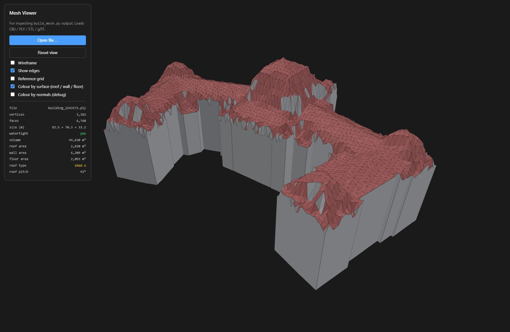

# Mesh Builder (experimental)



Build watertight 3D mesh hulls for buildings, footprint-exact, from a swisstopo
GeoTIFF DSM/DTM and an AV cadastral footprint. For GIS visualisation, not
analysis.

> **Sibling tools** in [../](..):
> * **[roof-shape-from-buildings3d/](../roof-shape-from-buildings3d/)** — Roof characteristics from swissBUILDINGS3D 3D meshes
> * **[green-roof-from-rs/](../green-roof-from-rs/)** — Green roof coverage via NDVI on swissIMAGE-RS multispectral imagery
> * **[floor-level-estimator/](../floor-level-estimator/)** — Per-floor estimator with construction-period (gbaup) factor

## Why this exists

[swissBUILDINGS3D 3.0](https://www.swisstopo.admin.ch/en/geodata/landscape/buildings3d3.html)
is the obvious source for 3D building geometry in Switzerland, but its quality
is uneven — some buildings are excellent, others are unusable. This tool
generates a mesh from the same raw data the rest of [`area-estimator`](../../../README.md)
already consumes (swissALTI3D + swissSURFACE3D), so the result is consistent
across every building in the country and degrades gracefully on weird footprints.

## What it produces

* **One mesh file per building**, named `building_<id>.{obj,ply,glb,stl}`
* **Watertight by construction** — verified with `trimesh.is_watertight`
* **Footprint-exact** — wall bases follow the AV polygon vertex-for-vertex
* **LOD2.5-ish** — the roof is a triangulated DSM clip (smooth, captures
  real-world bumps), not a planar-faced LoD2.

For pure visualisation in QGIS 3D, ArcGIS Pro, Cesium, or similar, this
"smooth roof" form is often preferred over true LoD2 — it never invents
roof shapes that aren't there. If you need planar roof surfaces for
energy / solar / CityGML semantics, use [roofer](https://github.com/3DBAG/roofer)
instead (point cloud input only).

## Algorithm

| Step | What | How |
|---|---|---|
| 1 | Normalise polygon | `_normalize_polygon`: largest part of MultiPolygon, strip interior rings, force CCW exterior orientation |
| 2 | Densify boundary | Add vertices along the exterior every `--boundary-spacing` m (default 0.5) |
| 3 | Interior grid + dedup | `volume.create_aligned_grid_points` (orientation-aligned, voxel = `--interior-spacing`, default 0.5); `scipy.cKDTree` drops interior points within `boundary_spacing/4` of any boundary vertex |
| 4 | Sample DTM at all points | `volume.TileIndex.sample_heights` (`alti3d`). Per-vertex, **not** mean — so the floor follows the slope under the building |
| 5 | Sample DSM at all points | Same call (`surface3d`). Clamped against local DTM for sample-noise tolerance |
| 6 | Roof CDT | Shewchuk's `triangle` over (boundary + interior) with boundary edges as constraints. PSLG mode (`pQ`) — no Steiner points, vertex indices preserved |
| 7 | Floor CDT | Same `triangle` call over the boundary alone, lifted to per-vertex DTM. Reverse winding so the floor normal points down |
| 8 | Walls | Vectorised: two triangles per consecutive boundary edge, top (DSM) → bottom (DTM). Outward-facing for CCW exterior |
| 9 | Assemble | One `trimesh.Trimesh(..., process=False)`. `is_watertight` is checked and any failure raises — construction is the contract |

The boundary vertex set is **shared** between the roof's outer ring, the wall
tops, the wall bottoms, and the floor outline. No gap can appear by
construction — no plane fitting, no hole filling, no topology repair, and
trimesh is told not to silently merge or drop anything either.

## Quick start

### Install

From the project root:

```bash
pip install -r python/requirements.txt
pip install -r experimental/mesh-builder/requirements.txt
```

### Run

```bash
cd experimental/mesh-builder
python main.py ../../data/example.csv \
    --av D:/AV_data/AV_Switzerland.gpkg \
    --dsm-dir D:/swissSURFACE3D \
    --dtm-dir D:/swissALTI3D \
    --output-dir ./out
```

The CSV format matches the main pipeline — `id` and `egid` columns, looked up
against the AV layer with one push-down WHERE filter.

## CLI reference

| Argument | Required | Default | Description |
|---|---|---|---|
| `input_csv` | yes | — | CSV with `id` + `egid` columns |
| `--av` | yes | — | AV GeoPackage path |
| `--dsm-dir` | yes | — | swissSURFACE3D tile directory |
| `--dtm-dir` | yes | — | swissALTI3D tile directory |
| `--output-dir` | no | `./meshes` | Output mesh directory |
| `--boundary-spacing` | no | `0.5` | Max distance between adjacent boundary vertices [m] |
| `--interior-spacing` | no | `1.0` | Interior DSM sampling grid cell size [m]; bump to 2.0 to cut face count 4× |
| `--smooth-radius` | no | `1.5` | Radius (m) for KDTree-based DSM outlier rejection. `0` disables both fine and coarse smoothing passes |
| `--colour` | no | off | Bake per-face colours into the file (roof red, walls grey, floor dark grey). Off by default — the viewer derives colours at render time |
| `--format` | no | `ply` | Output mesh format: `ply`, `obj`, `glb`, `stl` |
| `--limit` | no | — | Stop after this many buildings |
| `-v`, `--verbose` | no | off | Debug logging |

## Output

Default output format is **PLY** (single file, preserves face colours when
`--colour` is set, sidesteps trimesh's float32 PLY-export precision trap by
exporting in local coordinates with a `<file>.ply.offset.json` sidecar
recording the absolute LV95 origin).

| Format | Best for |
|---|---|
| `ply` | CloudCompare, MeshLab, Three.js (default — single file, supports per-face colours) |
| `obj` | QGIS 3D, generic 3D viewers, Blender |
| `glb` | Cesium, web 3D, Three.js |
| `stl` | 3D printing |

For ArcGIS Pro Multipatch, convert from OBJ via the `Import 3D Files` GP tool.
For CityJSON, post-process with [cjio](https://github.com/cityjson/cjio).

Each mesh file is named `building_<egid>.{ply,obj,glb,stl}`. Alongside it
sits a `building_<egid>.ply.offset.json` sidecar with the absolute LV95
origin needed to recover global coordinates from the locally-translated mesh:

```json
{
  "lv95_offset_m": [2599958.5, 1199938.0, 577.4],
  "crs": "EPSG:2056",
  "note": "Add this XYZ vector to every mesh vertex to recover absolute LV95 coordinates."
}
```

## Limitations

* **Interior holes (courtyards) are stripped** and a warning is logged.
  Hole-aware meshing needs the inner rings as additional CDT constraints
  plus a hole-marker point for `triangle`.
* **MultiPolygon footprints** take only the largest part and log a warning
  with the dropped area. Multi-part buildings (main + detached annex) should
  be meshed independently and concatenated — straightforward extension.
* **The coarse smoothing pass treats features narrower than ~3 m × 3 m as
  thin spikes** and replaces them with the surrounding background. This
  removes lift overruns, stair towers, antenna masts, and narrow chimneys
  (the intended behaviour). Real architecture at that scale (small dormers,
  ventilation stacks) is affected too. See the "Tuning" section below.
* **Smooth roofs only** — see "What it produces" above. Not planar LoD2.
* **Single-threaded** — no parallel batching yet. Trivially wrappable in
  `concurrent.futures.ProcessPoolExecutor`.

## Files

| File | Purpose |
|---|---|
| [main.py](main.py) | The whole prototype — algorithm + CLI |
| [viewer.html](viewer.html) | Standalone three.js inspector (drag-and-drop OBJ/PLY/STL/glTF), surface colouring, in-browser stats + roof classifier |
| [requirements.txt](requirements.txt) | Adds `trimesh`, `triangle`, and `scipy` on top of parent requirements |
| [RESEARCH.md](RESEARCH.md) | Living research doc — tools, papers, datasets, standards relevant to building reconstruction |
| [Preview1.jpg](Preview1.jpg) | Preview screenshot (the hero image at the top of this README) |
| [README.md](README.md) | This file |

## Data sources

| Dataset | Provider | URL | Used as |
|---|---|---|---|
| swissALTI3D | swisstopo | [swisstopo.admin.ch](https://www.swisstopo.admin.ch/en/height-model-swissalti3d) | DTM (terrain) at 0.5 m, the `--dtm-dir` input |
| swissSURFACE3D Raster | swisstopo | [swisstopo.admin.ch](https://www.swisstopo.admin.ch/en/height-model-swisssurface3d-raster) | DSM (surface) at 0.5 m, the `--dsm-dir` input |
| Amtliche Vermessung (AV) | Cantons via geodienste.ch | [geodienste.ch/services/av](https://www.geodienste.ch/services/av) | Cadastral building footprints, the `--av` input |
| GWR (Gebäude- und Wohnungsregister) | Federal Statistical Office | [housing-stat.ch](https://www.housing-stat.ch/) | EGID lookup keys for the input CSV |

All four are open data, free for any use (consult the linked terms of use for
attribution requirements). Tile fetching for swissALTI3D and swissSURFACE3D
is handled by the parent project's [`python/tile_fetcher.py`](../../python/tile_fetcher.py).

## Tuning

The smoothing has constants you might want to adjust for unusual buildings.
They live near the top of [main.py](main.py):

| Constant | Default | What it does | When to change |
|---|---|---|---|
| `_SMOOTH_K` | 12 | k-NN size for the fine pass | Rarely |
| `_SMOOTH_UPPER_MAD` / `_SMOOTH_LOWER_MAD` | 4.0 | MAD threshold for the fine pass | Lower = more aggressive on noisy roofs |
| `_SMOOTH_MIN_SUPPORT` | 3 | Min same-z neighbours to keep a fine outlier | 2 = more aggressive, 4 = preserves smaller features |
| `_SMOOTH_COARSE_RADIUS_M` | 5.0 | Coarse-pass radius | Larger = catches wider thin features |
| `_SMOOTH_COARSE_HEIGHT_GAP_M` | 2.0 | Min height above background to flag a spike | Larger = more permissive |
| `_SMOOTH_COARSE_MIN_SUPPORT` | 6 | Min same-z neighbours to keep a coarse spike | Lower = more aggressive |

The threshold sits cleanly between **2×2 verts (removed)** and **3×3 verts
(preserved)** at the default 1 m grid spacing. To preserve smaller features
(real chimneys), bump `_SMOOTH_COARSE_MIN_SUPPORT` down to 3 or 4.

`--smooth-radius 0` disables **both** fine and coarse passes.

## Performance notes

* Triangulation cost is roughly linear in footprint area at fixed grid spacing.
  A typical residential footprint (~150 m²) at 0.5 m spacing builds in
  milliseconds; a 100 × 100 m warehouse runs in seconds and produces a PLY
  in the few-hundred-KB range. For batch portfolios consider
  `--interior-spacing 2.0` to cut face count 4×.
* The interior dedup uses `scipy.cKDTree` for O((N+M) log N), constant memory.
  An earlier broadcast-based version OOM'd on warehouses.

## Inspecting results

[viewer.html](viewer.html) is a single-file three.js viewer (CDN, no build step,
ES modules via importmap). Open it in a browser, drag-and-drop a generated
OBJ / PLY / STL / glTF file, and you get:

* Orbit / pan / zoom (Z-up like LV95)
* **Surface colouring** (red roof / light wall / dark floor) computed from face
  normals at render time. Toggleable. The classifier (see [Roof shape taxonomy](#roof-shape-taxonomy)
  below) uses the same nz threshold so colours and stats agree.
* Wireframe + edge overlay toggles, plus a "colour by normals" debug mode
* **Stats panel** with:
  - Vertex / face count, bounding box, watertight verification
    (counts edges → every edge must appear in exactly 2 faces, the same
    criterion `trimesh.is_watertight` uses)
  - **Volume** (signed-tetrahedron sum, divergence theorem)
  - **Per-class surface areas** (roof / wall / floor)
  - **Roof type + pitch** with a confidence indicator (★ high, ◐ medium, ○ low)
* Drag-and-drop file pickup or click-to-pick

Open it directly from disk or via a local server — both work because it has no
imports from sibling files.

## Roof shape taxonomy

There's no single universal standard for naming roof shapes. The major
reference taxonomies, ranked by how widely they're actually used:

| Standard | Authority | Notes |
|---|---|---|
| **[OpenStreetMap `roof:shape=*`](https://wiki.openstreetmap.org/wiki/Key:roof:shape)** | Community | The most pragmatic. Used by [F4Map](https://demo.f4map.com/), [OSMBuildings](https://osmbuildings.org/), [OSM2World](http://osm2world.org/) for 3D rendering |
| **[CityGML 2.0 `RoofType`](https://www.sig3d.org/codelists/citygml/2.0/building/2.0/_AbstractBuilding_roofType.xml)** | OGC / SIG3D | Formal standard. Numeric codes (1000 = Flat, 1030 = Gabled, 1040 = Hipped, …). Used by all CityGML / CityJSON datasets |
| **[INSPIRE Building `RoofTypeValue`](https://inspire.ec.europa.eu/codelist/RoofTypeValue)** | EU | European Directive code list. Derived from CityGML |
| **ALKIS Dachform** | German cadastre | Numeric codes (1000 = Flachdach, 3100 = Satteldach, 3200 = Walmdach, …). German national standard |
| **[SIG3D Modeling Guide](https://files.sig3d.org/file/ag-qualitaet/201311_SIG3D_Modeling_Guide_for_3D_Objects_Part_2.pdf)** | German technical guide | Defines parameter spaces for each shape — useful reference for implementing classifiers |

The Swiss cadastre (AV) does **not** carry roof-shape attributes, and
swissBUILDINGS3D 3.0 produces LoD2 mesh geometry without explicit shape
labels. So in a Swiss workflow, the roof type isn't given to you — it has
to be derived from the geometry, which is exactly what the viewer's
classifier does.

### Common roof forms

The shapes most likely to come up in Swiss building stock, with German names
for cadastral context:

| Shape | DE | CityGML code | Description | Where you find it |
|---|---|---|---|---|
| **Flat** | Flachdach | 1000 | All slopes < ~5°. May have a slight drainage pitch | Commercial, industrial, modern residential, warehouses |
| **Shed** (mono-pitch) | Pultdach | 1010 | Single sloped surface, no ridge | Annexes, garages, modern architecture |
| **Dual pent** | Grabendach | 1020 | Two opposing mono-pitches with a central low gutter (rare) | Industrial, some modernist |
| **Gable** | Satteldach | 1030 | Two slopes meeting at a horizontal ridge, vertical gable ends | Classic European house, **the dominant form in alpine Switzerland** |
| **Hip** | Walmdach | 1040 | Four slopes meeting at a peak (or short ridge), no vertical gable ends | Older farm houses, formal residences |
| **Half-hip** | Krüppelwalmdach | 1050 | Hybrid: gable below, hip cut at the top | **Common in traditional Swiss alpine houses** |
| **Mansard** | Mansarddach | 1060 | Two pitches per side: steep lower, shallow upper | Belle-époque villas, hotels, French-influenced architecture |
| **Pavilion** | Zeltdach | 1070 | Hipped roof on a square footprint, all four slopes equal length | Towers, gazebos, summerhouses |
| **Pyramidal** | Pyramidendach | 1070 (special) | Four equal slopes meeting at a single point | Small towers, observatories |
| **Saltbox** | Schleppdach | 1090 | Asymmetric gable: short slope on one side, long slope on the other | Older lean-to-extended houses |
| **Barrel** | Tonnendach | 1100 | Curved single surface | Train stations, some warehouses |
| **Sawtooth** | Sheddach | (separate code) | Series of mono-pitches with vertical north-facing glazing | Factories, workshops |
| **Butterfly** | Schmetterlingsdach | 1110 | Two slopes meeting at a central valley (inverse gable) | Modernist houses |
| **Dome** | Kuppeldach | 1120 | Spherical or hemispherical | Religious buildings, observatories |
| **Complex** | Mehrteiliges Dach | — | Multi-element combinations or irregular | Churches, palaces, hospitals, multi-wing buildings |

### What the viewer's classifier reports

The viewer derives a roof label from the **face-normal histogram** of the
mesh — area-weighted azimuth bins, peak detection, decision tree on
(flat fraction, peak count, peak relationships, mean pitch). It's a
heuristic, not a learned model — see [RESEARCH.md §3](RESEARCH.md#3-roof-shape-classification)
for the algorithm and the academic alternatives.

Currently it produces a small subset of the taxonomy above, picked for what's
reliably distinguishable from a noisy DSM-derived face-normal histogram:

| Classifier label | Maps to | Confidence rule |
|---|---|---|
| **`flat`** | Flachdach (and very-shallow shed, dual pent if mostly flat) | High when flat fraction > 85% |
| **`shed`** | Pultdach | High when one strong azimuth peak, low pitch variance |
| **`gable`** | Satteldach (and mansard, gambrel — currently indistinguishable) | High when 2 opposing peaks |
| **`hip`** | Walmdach (and pavilion, pyramidal, half-hip) | High when 4 peaks span ≥ 3 of 4 quadrants |
| **`complex`** | Anything else: hip-and-valley, sawtooth, dome, multi-wing buildings | Always low — honest "I don't know" signal |

The label is followed by a confidence mark in the stats panel:

* **★** high confidence (> 0.8) — algorithm is sure
* **◐** medium confidence (0.5 – 0.8) — likely correct but worth double-checking
* **○** low confidence (< 0.5) — best guess, treat as "complex" in practice

The full breakdown (peaks, azimuths, exact confidence) is logged to the
browser console for debugging edge cases.

### What the classifier *can't* distinguish (yet)

* **Mansard from gable** — both have two opposing azimuth peaks. Distinguishing
  needs *pitch level count*: mansard has two distinct pitches per side, gable
  has one
* **Half-hip from hip** — both have ≥4 quadrants. Distinguishing needs detection
  of partial slopes / mixed gable-hip topology
* **Sawtooth from complex** — sawtooth needs *periodicity* detection (N evenly
  spaced peaks at the same pitch)
* **Dome from complex** — dome needs *curvature* detection (continuous normal
  variation, not discrete peaks)
* **Multi-wing buildings** — currently get one classification for the whole
  mesh. Per-wing classification needs a height-clustering preprocessing step
  to identify the wings first. See [RESEARCH.md §12](RESEARCH.md#12-things-we-havent-tried-but-maybe-should)

Adding any of these is a one-feature change to the classifier — see the
algorithm in [viewer.html](viewer.html), function `classifyRoofShape`.

## Research notes

The major LOD2 reconstruction tools ([roofer](https://github.com/3DBAG/roofer),
[3dfier](https://github.com/tudelft3d/3dfier),
[City4CFD](https://github.com/tudelft3d/City4CFD)) all require LAS/LAZ point
clouds — none accept a raster DSM directly. The deep-learning option
([SAT2LoD2](https://github.com/GDAOSU/LOD2BuildingModel)) accepts DSM but
requires CUDA and is designed for whole satellite scenes, not single buildings.

This prototype trades planar LoD2 surfaces (which is what those tools produce)
for guaranteed watertightness, footprint-exactness, and zero plane-fitting
failure modes. The tradeoff fits the "GIS visualisation" use case, where
swissBUILDINGS3D's inconsistency is the actual pain point.
